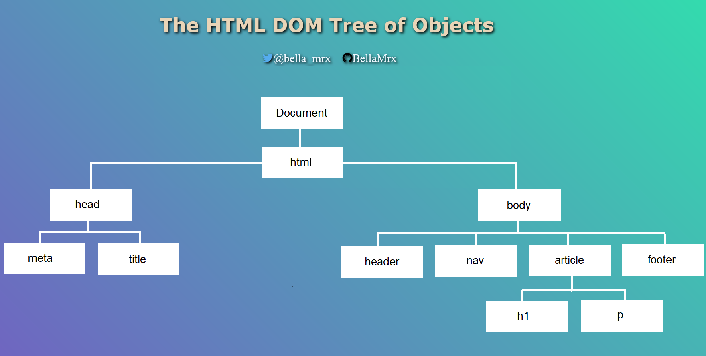
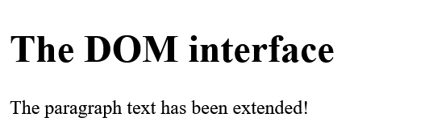
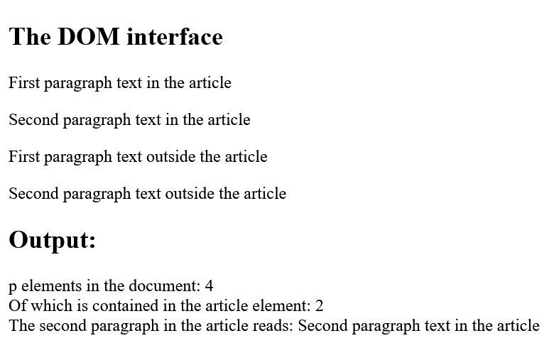
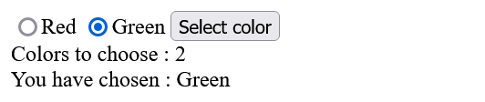
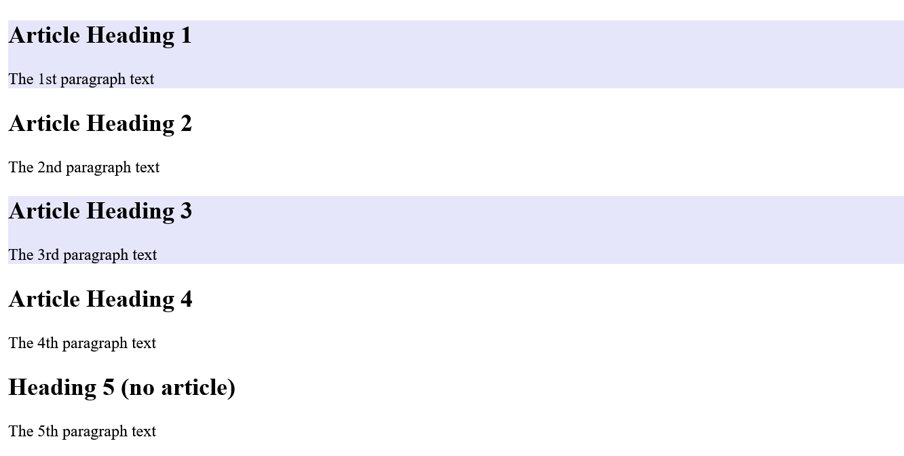
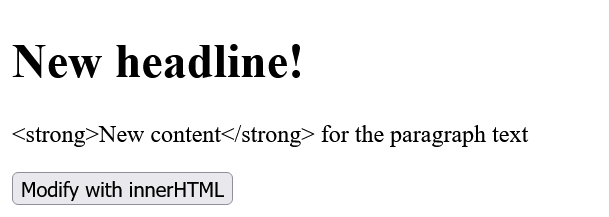
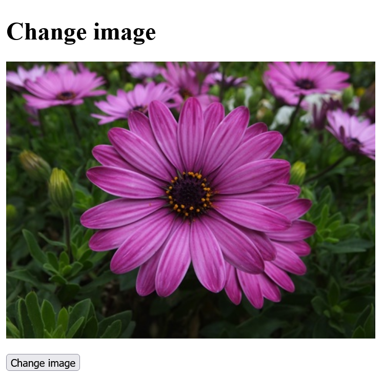

# DOM_Document-Object-Model
 
 Change web pages dynamically


---------------------------------------------

## Content
 1. Introduction to the DOM of an HTML document
 2. the `document` object
 3. The DOM programming interface 
 4. Access elements in the DOM  
 5. Change HTML element, attribute or style 
---------------------------------------------

## 1. Introduction to the DOM of an HTML document
With the DOM, you have access to all HTML elements of the document using JavaScript. This allows you to manipulate all HTML elements, HTML attributes, and CSS styles of a web page. Additionally, it is possible to add new HTML elements or attributes or remove existing ones, as well as react to all HTML events of a web page. 

The HTML elements of a document are composed into a hierarchical tree structure.

 

All individual elements of this DOM tree are **nodes** and are related to each other. E.g. the `head` -element (**parent element**) has two **child elements**, the `title` and the `meta` -element. The `title` and the `meta` -element are also called **siblings** here. The same applies to the `body` element. 

The HTML attributes and the contents of the HTML elements are also nodes of a DOM tree.

The three important node types:

   ```
    <p lang="en">The text ... </p>
   ```

Here, the `p` element is the HTML element node and this contains an HTML attribute node with `lang="en"` also the text of the `p` element is a real node (text node). These nodes in the DOM tree can be accessed using JavaScript.

Thanks to the division into node objects, where all HTML HTML documents, HTML attributes and the contents of a node represent and these nodes are related to each other in the tree by **parent**, **child**, or **sibling** relationships, it is possible to access each of these nodes using various **DOM methods** and **DOM properties**.


## 2. The `document` object
The `document` object is the topmost object of the DOM tree, only with it it is possible to access and modify all elements of the HTML document with JavaScript. It represents practically the whole web page and is the owner of all other nodes of the web page. If you want to access an element in an HTML document, this can be done e.g. with the `document` object and the `querySelector()` method.

   ```
    let element = document.querySelector('body');
   ```


## 3. The DOM programming interface
DOM provides various methods and properties for each object in the DOM tree. 

Example:
  [Complete Code](https://github.com/BellaMrx/DOM_Document-Object-Model/tree/main/Examples/Part_1) --> **Examples/Part_1/...** 

index.html:
   ```
    <body>
      <h1>The DOM interface</h1>
      <p>The paragraph text</p>
      <script src="scripts/script.js"></script>
    </body>
   ```

script.js:
   ```
    "use strict";

    let text = document.querySelector('p').innerHTML;
    if (text) {
      text += " " + "has been extended!";
      document.querySelector('p').innerHTML = text;
    }
   ```

Output:

 

Here, `querySelector()` is a method and `innerHTML` is a property of the `document` object. The `querySelector()` method is used to get access to an HTML element. The `innerHTML` property can be used to read the content of the HTML document or replace it with new content.


## 4. Access elements in the DOM
A very common use of JavaScript is to read, modify or extend elements in the DOM. For such accesses to the DOM and its element nodes, the `document` object provides several methods:

| Method             					 | Description                                         |
|----------------------------------- | ----------------------------------------------------|
| `document.getElementById()`   	    | Finds the element by the `id` attribute             |
| `document.getElementsByTagName()`  | Finds all elements with a specific tag name         |
| `document.getElementsByClassName()`| Finds all elements of a given CSS class             |
| `document.getElementsByName()`     | Finds all elements with a given `name` attribute    |
| `document.querySelector(x)`        | Returns the first element that corresponds to the specified CSS selector `x` |
| `document.querySelectorAll(x)`     | Returns a list with all elements that match the specified CSS selector `x` |

In practice, the two somewhat newer methods `querySelector()` and `querySelectorAll()` are sufficient because they can be used to search for the usual CSS selectors such as elements, classes and IDs, and other attributes.


### Find an HTML element with a specific `id` attribute
The `document.getElementById()` method is used to search for a specific `id` attribute of an element. This method returns a reference to the element object if successful or `null` if no element with this `id` attribute exists.

Example:
  [Complete Code](https://github.com/BellaMrx/DOM_Document-Object-Model/tree/main/Examples/Part_2) --> **Examples/Part_2/...** 

index.html:
   ```
    <body>
      <h1>The DOM interface</h1>
      <p id="message">The paragraph text</p>
      <script src="scripts/script.js"></script>
    </body>
   ```

script.js:
   ```
    "use strict";

    let element = document.getElementById('message');
    if (element) {
      let text = element.innerHTML;
      text += " " + "has been extended!";
      element.innerHTML = text;
    } else {
      console.log("Element with ID message was not found!");
    }
   ```

Output:

 


Another example with `querySelector()`:
  [Complete Code](https://github.com/BellaMrx/DOM_Document-Object-Model/tree/main/Examples/Part_3) --> **Examples/Part_3/...** 

index.html:
   ```
    <body>
      <h1>The DOM interface</h1>
      <p id="message">The paragraph text</p>
      <script src="scripts/script.js"></script>
    </body>
   ```

script.js:
   ```
    "use strict";

    let element = document.getElementById('message');
    if (element) {
      let text = element.innerHTML;
      text += " " + "has been extended!";
      element.innerHTML = text;
    } else {
      console.log("Element with ID message was not found!");
    }
   ```

Output:

 

The method with `querySelector('#message')` is equal to the one with `getElementById('message')`.


### Search HTML elements with a specific tag name
If you want to search for HTML elements with a specific tag name, you can use the `getElementsByTagName()` method. This method is useful if you want to return a collection of all nodes with a corresponding tag name. The individual nodes can be accessed with the square brackets `[]` and the corresponding index value. The number of elements is returned by the `length` property.

  [Complete Code](https://github.com/BellaMrx/DOM_Document-Object-Model/tree/main/Examples/Part_4) --> **Examples/Part_4/...** 

index.html:
   ```
    <body>
      <article id="lead">
         <h1>The DOM interface</h1>
         <p>First paragraph text in the article</p>
         <p>Second paragraph text in the article</p>                                    
      </article>
      <p>First paragraph text outside the article</p>
      <p>Second paragraph text outside the article</p>
      <h2>Output:</h2>
      <output></output>
      <script src="scripts/script.js"></script>
    </body>
   ```

script.js:
   ```
    let plainText = "";
    let pElements = document.getElementsByTagName('p');
    for (let i = 0; i < pElements.length; i++) {
      plainText += pElements[i].innerHTML + '\n';
    }
    console.log(plainText);     // output for demonstration

    let htmlText = "p elements in the document: " + pElements.length + "<br>";
    let articleElements = document.getElementById('lead');
    let articlePElements;
    if (articleElements) {
      articlePElements = articleElements.getElementsByTagName('p');
      htmlText += "Of which is contained in the article element: " + articlePElements.length + "<br>";
    }

    htmlText += "The second paragraph in the article reads: " + articlePElements[1].innerHTML;

    document.querySelector('output').innerHTML = htmlText;
   ```

Output:

 


Another example with `querySelectorAll()`:
  [Complete Code](https://github.com/BellaMrx/DOM_Document-Object-Model/tree/main/Examples/Part_5) --> **Examples/Part_5/...** 

index.html:
   ```
    <body>
      <article id="lead">
         <h1>The DOM interface</h1>
         <p>First paragraph text in the article</p>
         <p>Second paragraph text in the article</p>                                    
      </article>
      <p>First paragraph text outside the article</p>
      <p>Second paragraph text outside the article</p>
      <h2>Output:</h2>
      <output></output>
      <script src="scripts/script.js"></script>
    </body>
   ```

script.js:
   ```
    let plainText = "";
    let pElements = document.getElementsByTagName('p');
    for (let i = 0; i < pElements.length; i++) {
      plainText += pElements[i].innerHTML + '\n';
    }
    console.log(plainText);     // output for demonstration

    let htmlText = "p elements in the document: " + pElements.length + "<br>";
    let articlePElements = document.querySelectorAll('#lead p');
    if (articlePElements) {
      htmlText += "Of which is contained in the article element: " + articlePElements.length + "<br>";
    }

    htmlText += "The second paragraph in the article reads: " + articlePElements[1].innerHTML;

    document.querySelector('output').innerHTML = htmlText;
   ```

Output:

 

`getElementsByTagName()` does not return an array, but a **Node** list (Live NodeList) which can be read with a loop. No array typical method (e.g. `forEach()`) can be called directly on a node list.


### Search HTML elements with a specific **class** attribute
If you want to search for an HTML element with a specific CSS class name, you can use the `getElementsByClassName()` method.
   ```
    let element = document.getElementsByClassName('class');
   ```

Like `getElementsByTagName()`, this method returns all found nodes in the HTML document with the class name `class`.

In the meantime, it also makes sense to use the `querySelectorAll()` method to find all CSS classes:
   ```
    let element = document.querySelectorAll('.class');
   ```


### Search HTML elements with a specific **name** attribute
If you want to search for nodes in the HTML document that contain the HTML attribute `name` with a specific value, you can use the `getElementsByName()` method. 

  [Complete Code](https://github.com/BellaMrx/DOM_Document-Object-Model/tree/main/Examples/Part_6) --> **Examples/Part_6/...** 

index.html:
   ```
    <body>
      <input name="color" type="radio" value="red">Red
      <input name="color" type="radio" value="green">Green
      <input type="button" onclick="getColor()" value="Select color">
      <br>
      <output></output>
      <script src="scripts/script.js"></script>
    </body>
   ```

script.js:
   ```
    function getColor() {
      let colors = document.getElementsByName('color');
      let htmlText = "Colors to choose : " + colors.length +
         "<br>You have chosen  :";
       if (colors[0].checked) {
         htmlText += " Red";
      } else if (colors[1].checked) {
         htmlText += " Green";
      } else {
         htmlText += "None";
      }
      document.querySelector('output').innerHTML = htmlText;
    }
   ```

Output:

 

With the statement `let colors = document.getElementsByName('color');` in the function `getColor()` all nodes are found where `name="color"` is noted and stored in `colors`. The `if` conditions `(colors[i].checked)` are used to check whether the radio button was checked (= `true`) or not checked (= `false`).
The **event handler** `onclick` will execute the `getColor()` event function when the element is clicked.

Another example with `querySelector()` and `querySelectorAll()`:
  [Complete Code](https://github.com/BellaMrx/DOM_Document-Object-Model/tree/main/Examples/Part_7) --> **Examples/Part_7/...** 

index.html:
   ```
    <body>
      <input name="color" type="radio" value="red">Red
      <input name="color" type="radio" value="green">Green
      <input type="button" onclick="getColor()" value="Select color">
      <br>
      <output></output>
      <script src="scripts/script.js"></script>
    </body>
   ```

script.js:
   ```
    function getColor() {
      var colors = document.querySelectorAll('[name="color"]');
      let htmlText = "Colors to choose : " + colors.length +
        "<br>You have chosen  :";
      if (colors[0].checked) {
        htmlText += "Red";
      } else if (colors[1].checked) {
        htmlText += "Green";
      } else {
        htmlText += "None";
      }
      document.querySelector('output').innerHTML = htmlText;
    }
   ```

Output:

 


### Use `querySelector()` and `querySelectorAll()`
In practice these two methods are more flexible and faster than the `getElementById()` and `getElementsByTagName()` methods. The `querySelector()` method returns the first element found, and `querySelectorAll()` returns a list of all found elements in a **NodeList**.

  [Complete Code](https://github.com/BellaMrx/DOM_Document-Object-Model/tree/main/Examples/Part_8) --> **Examples/Part_8/...** 

index.html:
   ```
    <body>
      <article>
        <h2>Article Heading 1</h2>
        <p>The 1st paragraph text</p>
      </article>
      <article>
        <h2>Article Heading 2</h2>
        <p>The 2nd paragraph text</p>
      </article>
      <article>
        <h2>Article Heading 3</h2>
        <p>The 3rd paragraph text</p>
      </article>
      <article>
        <h2>Article Heading 4</h2>
        <p>The 4th paragraph text</p>
      </article>
      <h2>Heading 5 (no article)</h2>
      <p>The 5th paragraph text</p>
      <script src="scripts/script.js"></script>
    </body>
   ```

script.js:
   ```
    let element = document.querySelectorAll('article:nth-child(odd)');
    for (let i = 0; i < element.length; i++) {
      element[i].style.backgroundColor = "lavender";
    } 
   ```

Output:

 

Here, each `article` element has been styled with a background color if it is an odd element `(nth-child(odd))` from the parent element. If all even elements are to be styled, `(nth-child(even))` is used.


### More object and property collection
In addition, ready-made object collections and properties are available with which HTML elements can be found.

Example:
  [Complete Code](https://github.com/BellaMrx/DOM_Document-Object-Model/tree/main/Examples/Part_9) --> **Examples/Part_9/...** 

index.html:
  ```
   <head>
      <meta charset="utf-8">
      <title>DOM-Interfaces</title>
   </head>
   <body>
      <h1>Headline</h1>
      <output></output>
      <script src="scripts/script.js"></script>
   </body>
  ```

script.js:
  ```
   let analysis = document.querySelector('output');
   if (analysis) {
    analysis.innerHTML = "Content of the title element: " + document.title;
   }
  ```

Output:

 

With `document.title` the content of the `title` element can be returned.

This is just a convenience compared to `getElementsByTagName()` or `querySelector()`. Instead of using `document.title` you could have written the code as follows:

  ```
   document.querySelector('title').innerHTML
  ```
or

  ```
   document.querySelector('title').textContent
  ```

#### `innerHTML` vs. `textContent`
`innerHTML` returns all text, including HTML tags, contained in an element. With `textContent` only simple texts can be created as strings.

The following example returns all links of the HTML document:

  [Complete Code](https://github.com/BellaMrx/DOM_Document-Object-Model/tree/main/Examples/Part_10) --> **Examples/Part_10/...** 

index.html:
  ```
   <body>
    <h1>Headline</h1>
    <p>A link to <a href="https://github.com/BellaMrx">GitHub@Bella_Mrx</a></p>
    <p>Another link to <a href="https://twitter.com/bella_mrx">Twitter@bella_mrx</a></p>
    <output>Paragraph text</output>
    <script src="scripts/script.js"></script>
   </body>
  ```

script.js:
  ```
   let hyperlinks = document.links;
   let text = "";
   for (let i = 0; i < hyperlinks.length; i++) {
    text += i + 1 + ". Link: " + hyperlinks[i].innerHTML + "<br>";
   }
   document.querySelector('output').innerHTML = text;
  ```
  
Output:

 


#### Overview of ready-made object and property collections
| Method                     | Description                                        |
|--------------------------- | -------------------------------------------------- |
| `document.baseURI`   	     | Returns the absolute base URI of the HTML document |
| `document.body`   	       | Returns the 'body' element                         |
| `document.cookie`   	     | Returns all cookies of the document                |
| `document.doctype`   	     | Returns the 'doctype' of the document              |
| `document.documentElement` | Returns the 'html' element                         |
| `document.documentURI`   	 | Returns the URI of the document                    |
| `document.domain`   	     | Returns the domain name from the document server   |
| `document.domConfig`   	   | Returns the DOM configuration                      |
| `document.embeds`   	     | Returns a list with all 'embed' elements           |
| `document.forms`   	       | Returns a collection with all 'form' elements      |
| `document.head`   	       | Returns the 'head' element                         |
| `document.images`   	     | Returns a collection with all images               |
| `document.implementation`  | Returns the DOM implementation                     |
| `document.inputEncoding`   | Returns the character set of the document          |
| `document.lastModfied`   	 | Returns the date and time when the document was last modified |
| `document.links`   	       | Returns a collection of all links with the 'a' and 'area' element that contain a value in the 'href' attribute |
| `document.readyState`   	 | Returns the loading status of the document         |
| `document.referrer`   	   | Returns the URI of the linking document. The prerequisite is that this document was called via a link |
| `document.scripts`   	     | Returns a list with all 'script' elements          |
| `document.title`   	       | Returns the 'title' element                        |
| `document.URL`   	         | Returns the complete URL of the document           |


## 5. Change HTML element, attribute or style
There are several properties available to change the content of an HTML element. 

| Method                            | Description                                 |
|---------------------------------- | ------------------------------------------- |
| `element.innerHTML =`             | Changes the content of an HTML element      |
| `elemnet.attribute =`             | Changes the value of an HTML attribute      |
| `element.setAttribute(attr,val)`  | Also changes the value of an HTML attribute |
| `element.style.property =`        | Changes the style of an HTML element        |


### Modifies the content of HTML elements with `innerHTML`
The content of HTML elements can be changed with the `innerHTML` property. All elements, except the elements without closing HTML tag e.g. ``, have this property `innerHTML`.

  [Complete Code](https://github.com/BellaMrx/DOM_Document-Object-Model/tree/main/Examples/Part_11) --> **Examples/Part_11/...** 

index.html:
  ```
   <body>
    <h1>Headline</h1>
    <p>Paragraph text</p>
    <button onclick="changeContent()">Modify with innerHTML</button>
    <script src="scripts/script.js"></script>
   </body>
  ```

script.js:
  ```
   function changeContent() {
      document.querySelector('h1').innerHTML = "New headline!";
      let element = document.querySelector('p');
      element.innerHTML = "<strong>New content</strong> for the paragraph text";
   }
  ```
  
Output:

 

 

Here not only a text was transferred with `innerHTML`, but also a HTML tag `<strong>`, that is the advantage of `innerHTML`. Instead of `innerHTML` one could have used `textContent`, but then the HTML tag would have no effect, because the HTML tag is interpreted as a string.

script.js:
  ```
   function changeContent() {
      document.querySelector('h1').innerHTML = "New headline!";
      let element = document.querySelector('p');
      element.textContent = "<strong>New content</strong> for the paragraph text";
   }
  ```
 

To prevent a **cross-site scripting attack**, HTML5 dictates that an `innerHTML` inserted `<script>` tag must not be executed. However, since it is still possible to execute JavaScript without a `<script>` element, innerHTML should not be used for strings over which you have no control.


### Change the value of an HTML attribute

  [Complete Code](https://github.com/BellaMrx/DOM_Document-Object-Model/tree/main/Examples/Part_12) --> **Examples/Part_12/...** 

index.html:
  ```
   <body>
    <h1>Change image</h1>
    <p></p>
    <button onclick="changePicture()">Change image</button>
    <script src="scripts/script.js"></script>
   </body>
  ```

script.js:
  ```
   let xchange = true;

   function changePicture() {
    let current = document.querySelector('.pic');

    if (xchange) {
        current.src = "images/flower_480.jpg";
        current.alt = "Flowers";
        xchange = false;
      } else {
        current.src = "images/whale_480.jpg";
        current.alt = "Whale";
        xchange = true;
      }
   }
  ```
  
Output:

 

 

Here the JavaScript function `changePicture()` is started every time the button is pressed. First we used `querySelector()` to search for an element with `class="pic"` and then assigned it to the variable `current`. The `ìf` and `else` branches only serve to allow the button to be used more than once by checking the global variable `xchange` and setting it again in the corresponding branch according to the change. With `current.src` and `current.alt` and the assignment of another image or text the actual change of the attribute takes place.


### Change the style of an HTML element