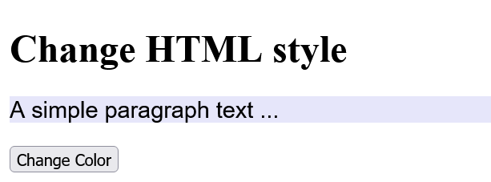
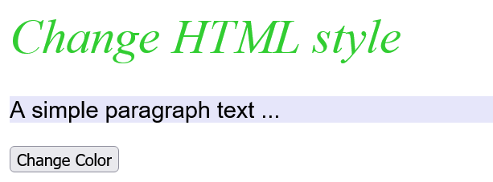
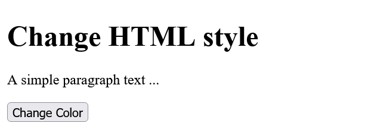
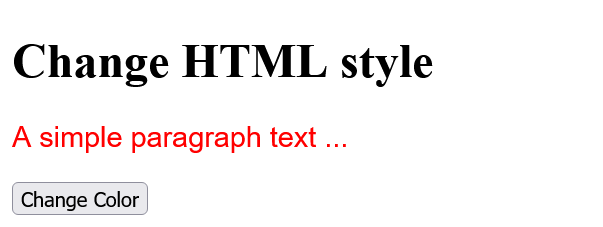
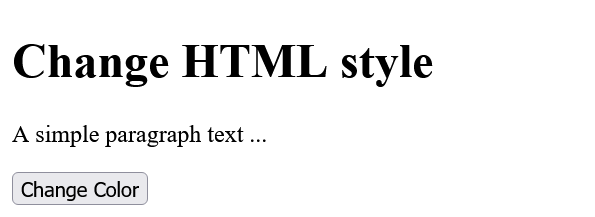
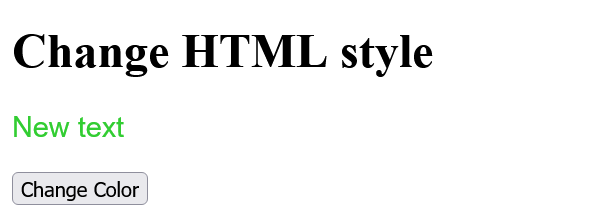

# DOM_Document-Object-Model
 
 Change web pages dynamically


---------------------------------------------

## Content
 1. Introduction to the DOM of an HTML document
 2. the `document` object
 3. The DOM programming interface 
 4. Access elements in the DOM  
 5. Change HTML element, attribute or style 
 6. React to JavaScript events
 7. Handle the events with the *event handler*

---------------------------------------------

## 1. Introduction to the DOM of an HTML document
With the DOM, you have access to all HTML elements of the document using JavaScript. This allows you to manipulate all HTML elements, HTML attributes, and CSS styles of a web page. Additionally, it is possible to add new HTML elements or attributes or remove existing ones, as well as react to all HTML events of a web page. 

The HTML elements of a document are composed into a hierarchical tree structure.

 

All individual elements of this DOM tree are *nodes* and are related to each other. E.g. the `head` -element (*parent element*) has two *child elements*, the `title` and the `meta` -element. The `title` and the `meta` -element are also called *siblings* here. The same applies to the `body` element. 

The HTML attributes and the contents of the HTML elements are also nodes of a DOM tree.

The three important node types:

   ```
    <p lang="en">The text ... </p>
   ```

Here, the `p` element is the HTML element node and this contains an HTML attribute node with `lang="en"` also the text of the `p` element is a real node (text node). These nodes in the DOM tree can be accessed using JavaScript.

Thanks to the division into node objects, where all HTML HTML documents, HTML attributes and the contents of a node represent and these nodes are related to each other in the tree by *parent*, *child*, or *sibling* relationships, it is possible to access each of these nodes using various *DOM methods* and *DOM properties*.


## 2. The `document` object
The `document` object is the topmost object of the DOM tree, only with it it is possible to access and modify all elements of the HTML document with JavaScript. It represents practically the whole web page and is the owner of all other nodes of the web page. If you want to access an element in an HTML document, this can be done e.g. with the `document` object and the `querySelector()` method.

   ```
    let element = document.querySelector('body');
   ```


## 3. The DOM programming interface
DOM provides various methods and properties for each object in the DOM tree. 

Example:
  [Complete Code](https://github.com/BellaMrx/DOM_Document-Object-Model/tree/main/Examples/Part_1) --> **Examples/Part_1/...** 

index.html:
   ```
    <body>
      <h1>The DOM interface</h1>
      <p>The paragraph text</p>
      <script src="scripts/script.js"></script>
    </body>
   ```

script.js:
   ```
    "use strict";

    let text = document.querySelector('p').innerHTML;
    if (text) {
      text += " " + "has been extended!";
      document.querySelector('p').innerHTML = text;
    }
   ```

Output:

 

Here, `querySelector()` is a method and `innerHTML` is a property of the `document` object. The `querySelector()` method is used to get access to an HTML element. The `innerHTML` property can be used to read the content of the HTML document or replace it with new content.


## 4. Access elements in the DOM
A very common use of JavaScript is to read, modify or extend elements in the DOM. For such accesses to the DOM and its element nodes, the `document` object provides several methods:

| Method             					 | Description                                         |
|----------------------------------- | ----------------------------------------------------|
| `document.getElementById()`   	    | Finds the element by the `id` attribute             |
| `document.getElementsByTagName()`  | Finds all elements with a specific tag name         |
| `document.getElementsByClassName()`| Finds all elements of a given CSS class             |
| `document.getElementsByName()`     | Finds all elements with a given `name` attribute    |
| `document.querySelector(x)`        | Returns the first element that corresponds to the specified CSS selector `x` |
| `document.querySelectorAll(x)`     | Returns a list with all elements that match the specified CSS selector `x` |

In practice, the two somewhat newer methods `querySelector()` and `querySelectorAll()` are sufficient because they can be used to search for the usual CSS selectors such as elements, classes and IDs, and other attributes.


### Find an HTML element with a specific `id` attribute
The `document.getElementById()` method is used to search for a specific `id` attribute of an element. This method returns a reference to the element object if successful or `null` if no element with this `id` attribute exists.

Example:
  [Complete Code](https://github.com/BellaMrx/DOM_Document-Object-Model/tree/main/Examples/Part_2) --> **Examples/Part_2/...** 

index.html:
   ```
    <body>
      <h1>The DOM interface</h1>
      <p id="message">The paragraph text</p>
      <script src="scripts/script.js"></script>
    </body>
   ```

script.js:
   ```
    "use strict";

    let element = document.getElementById('message');
    if (element) {
      let text = element.innerHTML;
      text += " " + "has been extended!";
      element.innerHTML = text;
    } else {
      console.log("Element with ID message was not found!");
    }
   ```

Output:

 


Another example with `querySelector()`:
  [Complete Code](https://github.com/BellaMrx/DOM_Document-Object-Model/tree/main/Examples/Part_3) --> **Examples/Part_3/...** 

index.html:
   ```
    <body>
      <h1>The DOM interface</h1>
      <p id="message">The paragraph text</p>
      <script src="scripts/script.js"></script>
    </body>
   ```

script.js:
   ```
    "use strict";

    let element = document.getElementById('message');
    if (element) {
      let text = element.innerHTML;
      text += " " + "has been extended!";
      element.innerHTML = text;
    } else {
      console.log("Element with ID message was not found!");
    }
   ```

Output:

 

The method with `querySelector('#message')` is equal to the one with `getElementById('message')`.


### Search HTML elements with a specific tag name
If you want to search for HTML elements with a specific tag name, you can use the `getElementsByTagName()` method. This method is useful if you want to return a collection of all nodes with a corresponding tag name. The individual nodes can be accessed with the square brackets `[]` and the corresponding index value. The number of elements is returned by the `length` property.

  [Complete Code](https://github.com/BellaMrx/DOM_Document-Object-Model/tree/main/Examples/Part_4) --> **Examples/Part_4/...** 

index.html:
   ```
    <body>
      <article id="lead">
         <h1>The DOM interface</h1>
         <p>First paragraph text in the article</p>
         <p>Second paragraph text in the article</p>                                    
      </article>
      <p>First paragraph text outside the article</p>
      <p>Second paragraph text outside the article</p>
      <h2>Output:</h2>
      <output></output>
      <script src="scripts/script.js"></script>
    </body>
   ```

script.js:
   ```
    let plainText = "";
    let pElements = document.getElementsByTagName('p');
    for (let i = 0; i < pElements.length; i++) {
      plainText += pElements[i].innerHTML + '\n';
    }
    console.log(plainText);     // output for demonstration

    let htmlText = "p elements in the document: " + pElements.length + "<br>";
    let articleElements = document.getElementById('lead');
    let articlePElements;
    if (articleElements) {
      articlePElements = articleElements.getElementsByTagName('p');
      htmlText += "Of which is contained in the article element: " + articlePElements.length + "<br>";
    }

    htmlText += "The second paragraph in the article reads: " + articlePElements[1].innerHTML;

    document.querySelector('output').innerHTML = htmlText;
   ```

Output:

 


Another example with `querySelectorAll()`:
  [Complete Code](https://github.com/BellaMrx/DOM_Document-Object-Model/tree/main/Examples/Part_5) --> **Examples/Part_5/...** 

index.html:
   ```
    <body>
      <article id="lead">
         <h1>The DOM interface</h1>
         <p>First paragraph text in the article</p>
         <p>Second paragraph text in the article</p>                                    
      </article>
      <p>First paragraph text outside the article</p>
      <p>Second paragraph text outside the article</p>
      <h2>Output:</h2>
      <output></output>
      <script src="scripts/script.js"></script>
    </body>
   ```

script.js:
   ```
    let plainText = "";
    let pElements = document.getElementsByTagName('p');
    for (let i = 0; i < pElements.length; i++) {
      plainText += pElements[i].innerHTML + '\n';
    }
    console.log(plainText);     // output for demonstration

    let htmlText = "p elements in the document: " + pElements.length + "<br>";
    let articlePElements = document.querySelectorAll('#lead p');
    if (articlePElements) {
      htmlText += "Of which is contained in the article element: " + articlePElements.length + "<br>";
    }

    htmlText += "The second paragraph in the article reads: " + articlePElements[1].innerHTML;

    document.querySelector('output').innerHTML = htmlText;
   ```

Output:

 

`getElementsByTagName()` does not return an array, but a *Node* list (Live NodeList) which can be read with a loop. No array typical method (e.g. `forEach()`) can be called directly on a node list.


### Search HTML elements with a specific *class* attribute
If you want to search for an HTML element with a specific CSS class name, you can use the `getElementsByClassName()` method.
   ```
    let element = document.getElementsByClassName('class');
   ```

Like `getElementsByTagName()`, this method returns all found nodes in the HTML document with the class name `class`.

In the meantime, it also makes sense to use the `querySelectorAll()` method to find all CSS classes:
   ```
    let element = document.querySelectorAll('.class');
   ```


### Search HTML elements with a specific *name* attribute
If you want to search for nodes in the HTML document that contain the HTML attribute `name` with a specific value, you can use the `getElementsByName()` method. 

  [Complete Code](https://github.com/BellaMrx/DOM_Document-Object-Model/tree/main/Examples/Part_6) --> **Examples/Part_6/...** 

index.html:
   ```
    <body>
      <input name="color" type="radio" value="red">Red
      <input name="color" type="radio" value="green">Green
      <input type="button" onclick="getColor()" value="Select color">
      <br>
      <output></output>
      <script src="scripts/script.js"></script>
    </body>
   ```

script.js:
   ```
    function getColor() {
      let colors = document.getElementsByName('color');
      let htmlText = "Colors to choose : " + colors.length +
         "<br>You have chosen  :";
       if (colors[0].checked) {
         htmlText += " Red";
      } else if (colors[1].checked) {
         htmlText += " Green";
      } else {
         htmlText += "None";
      }
      document.querySelector('output').innerHTML = htmlText;
    }
   ```

Output:

 

With the statement `let colors = document.getElementsByName('color');` in the function `getColor()` all nodes are found where `name="color"` is noted and stored in `colors`. The `if` conditions `(colors[i].checked)` are used to check whether the radio button was checked (= `true`) or not checked (= `false`).
The *event handler* `onclick` will execute the `getColor()` event function when the element is clicked.

Another example with `querySelector()` and `querySelectorAll()`:
  [Complete Code](https://github.com/BellaMrx/DOM_Document-Object-Model/tree/main/Examples/Part_7) --> **Examples/Part_7/...** 

index.html:
   ```
    <body>
      <input name="color" type="radio" value="red">Red
      <input name="color" type="radio" value="green">Green
      <input type="button" onclick="getColor()" value="Select color">
      <br>
      <output></output>
      <script src="scripts/script.js"></script>
    </body>
   ```

script.js:
   ```
    function getColor() {
      var colors = document.querySelectorAll('[name="color"]');
      let htmlText = "Colors to choose : " + colors.length +
        "<br>You have chosen  :";
      if (colors[0].checked) {
        htmlText += "Red";
      } else if (colors[1].checked) {
        htmlText += "Green";
      } else {
        htmlText += "None";
      }
      document.querySelector('output').innerHTML = htmlText;
    }
   ```

Output:

 


### Use `querySelector()` and `querySelectorAll()`
In practice these two methods are more flexible and faster than the `getElementById()` and `getElementsByTagName()` methods. The `querySelector()` method returns the first element found, and `querySelectorAll()` returns a list of all found elements in a **NodeList**.

  [Complete Code](https://github.com/BellaMrx/DOM_Document-Object-Model/tree/main/Examples/Part_8) --> **Examples/Part_8/...** 

index.html:
   ```
    <body>
      <article>
        <h2>Article Heading 1</h2>
        <p>The 1st paragraph text</p>
      </article>
      <article>
        <h2>Article Heading 2</h2>
        <p>The 2nd paragraph text</p>
      </article>
      <article>
        <h2>Article Heading 3</h2>
        <p>The 3rd paragraph text</p>
      </article>
      <article>
        <h2>Article Heading 4</h2>
        <p>The 4th paragraph text</p>
      </article>
      <h2>Heading 5 (no article)</h2>
      <p>The 5th paragraph text</p>
      <script src="scripts/script.js"></script>
    </body>
   ```

script.js:
   ```
    let element = document.querySelectorAll('article:nth-child(odd)');
    for (let i = 0; i < element.length; i++) {
      element[i].style.backgroundColor = "lavender";
    } 
   ```

Output:

 

Here, each `article` element has been styled with a background color if it is an odd element `(nth-child(odd))` from the parent element. If all even elements are to be styled, `(nth-child(even))` is used.


### More object and property collection
In addition, ready-made object collections and properties are available with which HTML elements can be found.

Example:
  [Complete Code](https://github.com/BellaMrx/DOM_Document-Object-Model/tree/main/Examples/Part_9) --> **Examples/Part_9/...** 

index.html:
  ```
   <head>
      <meta charset="utf-8">
      <title>DOM-Interfaces</title>
   </head>
   <body>
      <h1>Headline</h1>
      <output></output>
      <script src="scripts/script.js"></script>
   </body>
  ```

script.js:
  ```
   let analysis = document.querySelector('output');
   if (analysis) {
    analysis.innerHTML = "Content of the title element: " + document.title;
   }
  ```

Output:

 

With `document.title` the content of the `title` element can be returned.

This is just a convenience compared to `getElementsByTagName()` or `querySelector()`. Instead of using `document.title` you could have written the code as follows:

  ```
   document.querySelector('title').innerHTML
  ```
or

  ```
   document.querySelector('title').textContent
  ```

#### `innerHTML` vs. `textContent`
`innerHTML` returns all text, including HTML tags, contained in an element. With `textContent` only simple texts can be created as strings.

The following example returns all links of the HTML document:

  [Complete Code](https://github.com/BellaMrx/DOM_Document-Object-Model/tree/main/Examples/Part_10) --> **Examples/Part_10/...** 

index.html:
  ```
   <body>
    <h1>Headline</h1>
    <p>A link to <a href="https://github.com/BellaMrx">GitHub@Bella_Mrx</a></p>
    <p>Another link to <a href="https://twitter.com/bella_mrx">Twitter@bella_mrx</a></p>
    <output>Paragraph text</output>
    <script src="scripts/script.js"></script>
   </body>
  ```

script.js:
  ```
   let hyperlinks = document.links;
   let text = "";
   for (let i = 0; i < hyperlinks.length; i++) {
    text += i + 1 + ". Link: " + hyperlinks[i].innerHTML + "<br>";
   }
   document.querySelector('output').innerHTML = text;
  ```
  
Output:

 


#### Overview of ready-made object and property collections
| Method                     | Description                                        |
|--------------------------- | -------------------------------------------------- |
| `document.baseURI`   	     | Returns the absolute base URI of the HTML document |
| `document.body`   	       | Returns the 'body' element                         |
| `document.cookie`   	     | Returns all cookies of the document                |
| `document.doctype`   	     | Returns the 'doctype' of the document              |
| `document.documentElement` | Returns the 'html' element                         |
| `document.documentURI`   	 | Returns the URI of the document                    |
| `document.domain`   	     | Returns the domain name from the document server   |
| `document.domConfig`   	   | Returns the DOM configuration                      |
| `document.embeds`   	     | Returns a list with all 'embed' elements           |
| `document.forms`   	       | Returns a collection with all 'form' elements      |
| `document.head`   	       | Returns the 'head' element                         |
| `document.images`   	     | Returns a collection with all images               |
| `document.implementation`  | Returns the DOM implementation                     |
| `document.inputEncoding`   | Returns the character set of the document          |
| `document.lastModfied`   	 | Returns the date and time when the document was last modified |
| `document.links`   	       | Returns a collection of all links with the 'a' and 'area' element that contain a value in the 'href' attribute |
| `document.readyState`   	 | Returns the loading status of the document         |
| `document.referrer`   	   | Returns the URI of the linking document. The prerequisite is that this document was called via a link |
| `document.scripts`   	     | Returns a list with all 'script' elements          |
| `document.title`   	       | Returns the 'title' element                        |
| `document.URL`   	         | Returns the complete URL of the document           |


## 5. Change HTML element, attribute or style
There are several properties available to change the content of an HTML element. 

| Method                            | Description                                 |
|---------------------------------- | ------------------------------------------- |
| `element.innerHTML =`             | Changes the content of an HTML element      |
| `elemnet.attribute =`             | Changes the value of an HTML attribute      |
| `element.setAttribute(attr,val)`  | Also changes the value of an HTML attribute |
| `element.style.property =`        | Changes the style of an HTML element        |


### Modifies the content of HTML elements with `innerHTML`
The content of HTML elements can be changed with the `innerHTML` property. All elements, except the elements without closing HTML tag e.g. ``, have this property `innerHTML`.

  [Complete Code](https://github.com/BellaMrx/DOM_Document-Object-Model/tree/main/Examples/Part_11) --> **Examples/Part_11/...** 

index.html:
  ```
   <body>
    <h1>Headline</h1>
    <p>Paragraph text</p>
    <button onclick="changeContent()">Modify with innerHTML</button>
    <script src="scripts/script.js"></script>
   </body>
  ```

script.js:
  ```
   function changeContent() {
      document.querySelector('h1').innerHTML = "New headline!";
      let element = document.querySelector('p');
      element.innerHTML = "<strong>New content</strong> for the paragraph text";
   }
  ```
  
Output:

  

Here not only a text was transferred with `innerHTML`, but also a HTML tag `<strong>`, that is the advantage of `innerHTML`. Instead of `innerHTML` one could have used `textContent`, but then the HTML tag would have no effect, because the HTML tag is interpreted as a string.

script.js:
  ```
   function changeContent() {
      document.querySelector('h1').innerHTML = "New headline!";
      let element = document.querySelector('p');
      element.textContent = "<strong>New content</strong> for the paragraph text";
   }
  ```
 

To prevent a *cross-site scripting attack*, HTML5 dictates that an `innerHTML` inserted `<script>` tag must not be executed. However, since it is still possible to execute JavaScript without a `<script>` element, innerHTML should not be used for strings over which you have no control.


### Change the value of an HTML attribute

  [Complete Code](https://github.com/BellaMrx/DOM_Document-Object-Model/tree/main/Examples/Part_12) --> **Examples/Part_12/...** 

index.html:
  ```
   <body>
    <h1>Change image</h1>
    <p></p>
    <button onclick="changePicture()">Change image</button>
    <script src="scripts/script.js"></script>
   </body>
  ```

script.js:
  ```
   let xchange = true;

   function changePicture() {
    let current = document.querySelector('.pic');

    if (xchange) {
        current.src = "images/flower_480.jpg";
        current.alt = "Flowers";
        xchange = false;
      } else {
        current.src = "images/whale_480.jpg";
        current.alt = "Whale";
        xchange = true;
      }
   }
  ```
  
Output:

  

Here the JavaScript function `changePicture()` is started every time the button is pressed. First we used `querySelector()` to search for an element with `class="pic"` and then assigned it to the variable `current`. The `ìf` and `else` branches only serve to allow the button to be used more than once by checking the global variable `xchange` and setting it again in the corresponding branch according to the change. With `current.src` and `current.alt` and the assignment of another image or text the actual change of the attribute takes place.


### Change the style of an HTML element

  [Complete Code](https://github.com/BellaMrx/DOM_Document-Object-Model/tree/main/Examples/Part_13) --> **Examples/Part_13/...** 

index.html:
  ```
   <body>
    <h1 class="headline">Change HTML style</h1>
    <p class="p-style">A simple paragraph text ...</p>
    <button onclick="changeColor()">Change Color</button>
    <script src="scripts/script.js"></script>
   </body>
  ```

script.js:
  ```
   let element = document.querySelector('.p-style');
   element.style.color = "black";
   element.style.background = "lavender";
   element.style.font = "1.2em Arial";

   function changeColor() {
     let headline = document.querySelector('.headline');
     headline.style.color = "limegreen";
     headline.style.font = "2.5em serif";
     headline.style.fontStyle = "italic";
   }
  ```

Output:

  

Here the style of the `<p>` element was changed and by clicking the button the `<h1>` element was changed too. The corresponding element is changed by assigning a CSS valid value to `style.property` e.g. `headline.style.color = "limegreen";`.

#### Camel Case
In CSS `font-style` is used with hyphen. In JavaScript the hyphen is set for the minus sign, and therefore the hyphen is not used there and the first letter after the actual hyphen is written as an uppercase letter so `fontStyle`. Or instead of `border-color`(CSS) would be `borderColor` in JavaScript.


## 6. React to JavaScript events
Web pages only become truly interactive with the help of *JavaScript events*. In the web browser, an *event* is triggered when an action is performed in the document or on a specific HTML element. For example, the web browser generates an event when the web page is fully loaded, the mouse is moved, or a button is clicked. The triggered event is then queued in an event queue to ensure that an event that was triggered first is also handled first (first-in-first-out principle). An event loop continuously checks whether a new event is present in the event queue and passes the event on to the so-called *event handler*.

You don't have to care about the *event types* themselves, they are already included in JavaScript and become applicable via special keywords. The number of existing events in JavaScript are pretty extensive:

| Event                                                              | Description                                   |
|------------------------------------------------------------------- | --------------------------------------------- |
| `onload`, `onunload`, `onresize`, `onscroll`, `onerror`, `onabort` | Events of the user interface of the window    |
| `onclick`, `ondblclick`, `onmousedown`, `onmousemove`, `onmouseover`, `onmouseout`, `onmouseup` | mouse event      |
| `onkeypress`, `onkeydown`, `onkeyup`                               | keyboard events                               |
| `onblur`, `onchange`, `onfocus`, `onreset`, `onselect`, `onsubmit` | form events                                   |
| `touchstart`, `touchend`, `touchcanel`, `touchleave`, `touchmove` | touch events                                  |
| `onplay`, `oncanplay`, `onpause`, `oncanplaythrough`, `onplaying`, `ondurationchange`, `onvolumechange`, `onended` | Events for playing video and audio |
| `ondrag`, `ondraging`, `ondragenter`, `ondragleave`, `ondragover`, `ondragstart`, `ondrop` | drag-and-drop events  |
| `animationstart`, `animationend`, `animationiteration`             | animation events for CSS animatons            |


The number of event types is huge. Here I will only explain the classic events of a user interface like mouse and keyboard events.

In addition to the type of the event, an *event target* is also required to which the event is connected, e.g. if a *click* event is to be used for a button, then this button must also be used as the *event target*, usually a `<button>` element.

In addition to the *event target* and the *event type*, a *callback function* is also needed to be called when the event for the event target has occurred. This *callback function* is set up with an *event handler* for a specific object and event type. A distinction is made here between *event handlers*, which are defined via the property (e.g. `onclick`), and *event listeners*, which are defined via the method `addEventListener()`. The difference is that per event only one *event handler* can be defined on an element, with an *event listener* several are possible.

When an event of the specified type is raised at the specified target, the web browser calls the event handler so that it can be taken care of with a JavaScript callback function and respond accordingly. 


## 7. Handle the events with the *event handler*
An *event handler* is a JavaScript statement or function that is executed when a specific JavaScript event is triggered. There are three ways to set up an event handler for an event:


### Set up event handler as HTML attribute in HTML element
With the event handler as HTML attribute, the script can be called when loading an HTML document if the HTMLL element has already been loaded.

  [Complete Code](https://github.com/BellaMrx/DOM_Document-Object-Model/tree/main/Examples/Part_14) --> **Examples/Part_14/...** 

index.html:
  ```
   <body>
    <h1 class="headline">Change HTML style</h1>
    <p class="p-style">A simple paragraph text ...</p>
    <button onclick="changeColor()">Change Color</button>  <!-- onclick event + function -->
    <script src="scripts/script.js"></script>
   </body>
  ```

script.js:
  ```
   function changeColor() {
     let headline = document.querySelector('.headline');
     headline.style.color = "limegreen";
     headline.style.font = "2.5em serif";
     headline.style.fontStyle = "italic";
   }
  ```

Output:

  

The disadvantage of this method is that only one event handler can be registered. The `addEventListener()` method, on the other hand, can be used to register several.


### Set up event handler as property of an object
For the event to be caught, we need an HTML element to catch the event and assign the event handler to this element.
  ```
   // Element which should catch the event
   let element = document.querySelector('selector');
   // Event to be intercepted and event handler
   element.onmouseover = function() {...};
  ```

Since functions are full-fledged objects in JavaScript, it is possible to assign them to a property.

And so the whole thing can be noted together:
  ```
   document.querySelector('selector').onmouseover = function() {...};
  ```

Example:

  [Complete Code](https://github.com/BellaMrx/DOM_Document-Object-Model/tree/main/Examples/Part_15) --> **Examples/Part_15/...** 

index.html:
  ```
   <body>
    <h1 class="headline">Change HTML style</h1>
    <p class="p-style">A simple paragraph text ...</p>
    <button id="button01">Change Color</button>
    <script src="scripts/script.js"></script>
   </body>
  ```

script.js:
  ```
   document.querySelector('#button01').onclick = function() {
     document.querySelector('.p-style').style.color = "red";
     document.querySelector('.p-style').style.font = "1.2em Arial";
   }
  ```

Output:

  

Here, a function has been assigned as an event handler to an HTML element where the value of `id` is equal to `button01`. This event handler is executed when the button is clicked ('onclick'). The event handler can be removed again withlife of `element.onclick=null;`. Thus, only one event handler can be assigned to each object for a given event. If another event handler is added to an event, the previous event handler is overwritten.


### Set up an event handler with `addEventListener()`
The `addEventListener()` method can be used to associate an HTML element with an event handler when a specific event occurs. Unlike assigning the event handler directly as a property to an object, the `addEventListener()` method can be used to add an event handler to an HTML element without overriding an already linked event. This allows multiple event handlers to be added to an element and the same event. 

  [Complete Code](https://github.com/BellaMrx/DOM_Document-Object-Model/tree/main/Examples/Part_16) --> **Examples/Part_16/...** 

index.html:
  ```
   <body>
    <h1 class="headline">Change HTML style</h1>
    <p class="p-style">A simple paragraph text ...</p>
    <button id="button01">Change Color</button>
    <script src="scripts/script.js"></script>
   </body>
  ```

script.js:
  ```
   let element = document.querySelector('#button01');
   if (element) {
     element.addEventListener("click", changeColor);
     element.addEventListener("click", changeText);
     element.addEventListener("mouseover", myborder);
     element.addEventListener("mouseout", noborder);
   } else {
     console.log("Error: Could not set up event handler!")
   }

  function changeColor() {
     document.querySelector('.p-style').style.color = "limegreen";
     document.querySelector('.p-style').style.font = "1.2em Arial";
   }

   function changeText() {
     document.querySelector('.p-style').innerHTML = "New text";
   }

   function myborder() {
     document.querySelector('.p-style').style.border = "1px solid black";
   }

   function noborder() {
     document.querySelector('.p-style').style.border = "0px solid black";
   }
  ```

Output:

  

