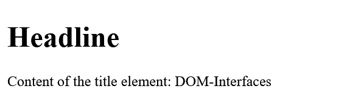
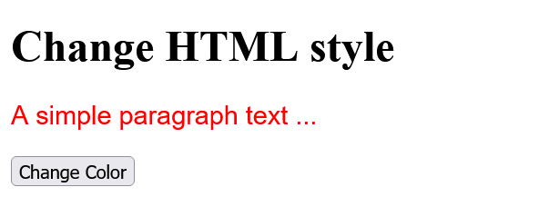

# DOM_Document-Object-Model
 
 Change web pages dynamically


---------------------------------------------

## Content
 1. Introduction to the DOM of an HTML document
 2. the `document` object
 3. The DOM programming interface 
 4. Access elements in the DOM  
 5. Change HTML element, attribute or style 
 6. React to JavaScript events
 7. Handle the events with the *event handler*
 8. Overview of popular JavaScript events
 9. Events with the `event` object 
 10. Prevent default action of events
 11. The event flow (*event propagation*)
 12. Add, change and remove HTML elements
 13. HTML forms and JavaScript

---------------------------------------------

## 1. Introduction to the DOM of an HTML document
With the DOM, you have access to all HTML elements of the document using JavaScript. This allows you to manipulate all HTML elements, HTML attributes, and CSS styles of a web page. Additionally, it is possible to add new HTML elements or attributes or remove existing ones, as well as react to all HTML events of a web page. 

The HTML elements of a document are composed into a hierarchical tree structure.

 

All individual elements of this DOM tree are *nodes* and are related to each other. E.g. the `head` -element (*parent element*) has two *child elements*, the `title` and the `meta` -element. The `title` and the `meta` -element are also called *siblings* here. The same applies to the `body` element. 

The HTML attributes and the contents of the HTML elements are also nodes of a DOM tree.

The three important node types:

   ```
    <p lang="en">The text ... </p>
   ```

Here, the `p` element is the HTML element node and this contains an HTML attribute node with `lang="en"` also the text of the `p` element is a real node (text node). These nodes in the DOM tree can be accessed using JavaScript.

Thanks to the division into node objects, where all HTML HTML documents, HTML attributes and the contents of a node represent and these nodes are related to each other in the tree by *parent*, *child*, or *sibling* relationships, it is possible to access each of these nodes using various *DOM methods* and *DOM properties*.


## 2. The `document` object
The `document` object is the topmost object of the DOM tree, only with it it is possible to access and modify all elements of the HTML document with JavaScript. It represents practically the whole web page and is the owner of all other nodes of the web page. If you want to access an element in an HTML document, this can be done e.g. with the `document` object and the `querySelector()` method.

   ```
    let element = document.querySelector('body');
   ```


## 3. The DOM programming interface
DOM provides various methods and properties for each object in the DOM tree. 

Example:
  [Complete Code](https://github.com/BellaMrx/DOM_Document-Object-Model/tree/main/Examples/Part_1) --> **Examples/Part_1/...** 

index.html:
   ```
    <body>
      <h1>The DOM interface</h1>
      <p>The paragraph text</p>
      <script src="scripts/script.js"></script>
    </body>
   ```

script.js:
   ```
    "use strict";

    let text = document.querySelector('p').innerHTML;
    if (text) {
      text += " " + "has been extended!";
      document.querySelector('p').innerHTML = text;
    }
   ```

Output:

 

Here, `querySelector()` is a method and `innerHTML` is a property of the `document` object. The `querySelector()` method is used to get access to an HTML element. The `innerHTML` property can be used to read the content of the HTML document or replace it with new content.


## 4. Access elements in the DOM
A very common use of JavaScript is to read, modify or extend elements in the DOM. For such accesses to the DOM and its element nodes, the `document` object provides several methods:

| Method             					 | Description                                         |
|----------------------------------- | ----------------------------------------------------|
| `document.getElementById()`   	    | Finds the element by the `id` attribute             |
| `document.getElementsByTagName()`  | Finds all elements with a specific tag name         |
| `document.getElementsByClassName()`| Finds all elements of a given CSS class             |
| `document.getElementsByName()`     | Finds all elements with a given `name` attribute    |
| `document.querySelector(x)`        | Returns the first element that corresponds to the specified CSS selector `x` |
| `document.querySelectorAll(x)`     | Returns a list with all elements that match the specified CSS selector `x` |

In practice, the two somewhat newer methods `querySelector()` and `querySelectorAll()` are sufficient because they can be used to search for the usual CSS selectors such as elements, classes and IDs, and other attributes.


### Find an HTML element with a specific `id` attribute
The `document.getElementById()` method is used to search for a specific `id` attribute of an element. This method returns a reference to the element object if successful or `null` if no element with this `id` attribute exists.

Example:
  [Complete Code](https://github.com/BellaMrx/DOM_Document-Object-Model/tree/main/Examples/Part_2) --> **Examples/Part_2/...** 

index.html:
   ```
    <body>
      <h1>The DOM interface</h1>
      <p id="message">The paragraph text</p>
      <script src="scripts/script.js"></script>
    </body>
   ```

script.js:
   ```
    "use strict";

    let element = document.getElementById('message');
    if (element) {
      let text = element.innerHTML;
      text += " " + "has been extended!";
      element.innerHTML = text;
    } else {
      console.log("Element with ID message was not found!");
    }
   ```

Output:

 


Another example with `querySelector()`:
  [Complete Code](https://github.com/BellaMrx/DOM_Document-Object-Model/tree/main/Examples/Part_3) --> **Examples/Part_3/...** 

index.html:
   ```
    <body>
      <h1>The DOM interface</h1>
      <p id="message">The paragraph text</p>
      <script src="scripts/script.js"></script>
    </body>
   ```

script.js:
   ```
    "use strict";

    let element = document.getElementById('message');
    if (element) {
      let text = element.innerHTML;
      text += " " + "has been extended!";
      element.innerHTML = text;
    } else {
      console.log("Element with ID message was not found!");
    }
   ```

Output:

 

The method with `querySelector('#message')` is equal to the one with `getElementById('message')`.


### Search HTML elements with a specific tag name
If you want to search for HTML elements with a specific tag name, you can use the `getElementsByTagName()` method. This method is useful if you want to return a collection of all nodes with a corresponding tag name. The individual nodes can be accessed with the square brackets `[]` and the corresponding index value. The number of elements is returned by the `length` property.

  [Complete Code](https://github.com/BellaMrx/DOM_Document-Object-Model/tree/main/Examples/Part_4) --> **Examples/Part_4/...** 

index.html:
   ```
    <body>
      <article id="lead">
         <h1>The DOM interface</h1>
         <p>First paragraph text in the article</p>
         <p>Second paragraph text in the article</p>                                    
      </article>
      <p>First paragraph text outside the article</p>
      <p>Second paragraph text outside the article</p>
      <h2>Output:</h2>
      <output></output>
      <script src="scripts/script.js"></script>
    </body>
   ```

script.js:
   ```
    let plainText = "";
    let pElements = document.getElementsByTagName('p');
    for (let i = 0; i < pElements.length; i++) {
      plainText += pElements[i].innerHTML + '\n';
    }
    console.log(plainText);     // output for demonstration

    let htmlText = "p elements in the document: " + pElements.length + "<br>";
    let articleElements = document.getElementById('lead');
    let articlePElements;
    if (articleElements) {
      articlePElements = articleElements.getElementsByTagName('p');
      htmlText += "Of which is contained in the article element: " + articlePElements.length + "<br>";
    }

    htmlText += "The second paragraph in the article reads: " + articlePElements[1].innerHTML;

    document.querySelector('output').innerHTML = htmlText;
   ```

Output:

 


Another example with `querySelectorAll()`:
  [Complete Code](https://github.com/BellaMrx/DOM_Document-Object-Model/tree/main/Examples/Part_5) --> **Examples/Part_5/...** 

index.html:
   ```
    <body>
      <article id="lead">
         <h1>The DOM interface</h1>
         <p>First paragraph text in the article</p>
         <p>Second paragraph text in the article</p>                                    
      </article>
      <p>First paragraph text outside the article</p>
      <p>Second paragraph text outside the article</p>
      <h2>Output:</h2>
      <output></output>
      <script src="scripts/script.js"></script>
    </body>
   ```

script.js:
   ```
    let plainText = "";
    let pElements = document.getElementsByTagName('p');
    for (let i = 0; i < pElements.length; i++) {
      plainText += pElements[i].innerHTML + '\n';
    }
    console.log(plainText);     // output for demonstration

    let htmlText = "p elements in the document: " + pElements.length + "<br>";
    let articlePElements = document.querySelectorAll('#lead p');
    if (articlePElements) {
      htmlText += "Of which is contained in the article element: " + articlePElements.length + "<br>";
    }

    htmlText += "The second paragraph in the article reads: " + articlePElements[1].innerHTML;

    document.querySelector('output').innerHTML = htmlText;
   ```

Output:

 

`getElementsByTagName()` does not return an array, but a *Node* list (Live NodeList) which can be read with a loop. No array typical method (e.g. `forEach()`) can be called directly on a node list.


### Search HTML elements with a specific *class* attribute
If you want to search for an HTML element with a specific CSS class name, you can use the `getElementsByClassName()` method.
   ```
    let element = document.getElementsByClassName('class');
   ```

Like `getElementsByTagName()`, this method returns all found nodes in the HTML document with the class name `class`.

In the meantime, it also makes sense to use the `querySelectorAll()` method to find all CSS classes:
   ```
    let element = document.querySelectorAll('.class');
   ```


### Search HTML elements with a specific *name* attribute
If you want to search for nodes in the HTML document that contain the HTML attribute `name` with a specific value, you can use the `getElementsByName()` method. 

  [Complete Code](https://github.com/BellaMrx/DOM_Document-Object-Model/tree/main/Examples/Part_6) --> **Examples/Part_6/...** 

index.html:
   ```
    <body>
      <input name="color" type="radio" value="red">Red
      <input name="color" type="radio" value="green">Green
      <input type="button" onclick="getColor()" value="Select color">
      <br>
      <output></output>
      <script src="scripts/script.js"></script>
    </body>
   ```

script.js:
   ```
    function getColor() {
      let colors = document.getElementsByName('color');
      let htmlText = "Colors to choose : " + colors.length +
         "<br>You have chosen  :";
       if (colors[0].checked) {
         htmlText += " Red";
      } else if (colors[1].checked) {
         htmlText += " Green";
      } else {
         htmlText += "None";
      }
      document.querySelector('output').innerHTML = htmlText;
    }
   ```

Output:

 

With the statement `let colors = document.getElementsByName('color');` in the function `getColor()` all nodes are found where `name="color"` is noted and stored in `colors`. The `if` conditions `(colors[i].checked)` are used to check whether the radio button was checked (= `true`) or not checked (= `false`).
The *event handler* `onclick` will execute the `getColor()` event function when the element is clicked.

Another example with `querySelector()` and `querySelectorAll()`:
  [Complete Code](https://github.com/BellaMrx/DOM_Document-Object-Model/tree/main/Examples/Part_7) --> **Examples/Part_7/...** 

index.html:
   ```
    <body>
      <input name="color" type="radio" value="red">Red
      <input name="color" type="radio" value="green">Green
      <input type="button" onclick="getColor()" value="Select color">
      <br>
      <output></output>
      <script src="scripts/script.js"></script>
    </body>
   ```

script.js:
   ```
    function getColor() {
      var colors = document.querySelectorAll('[name="color"]');
      let htmlText = "Colors to choose : " + colors.length +
        "<br>You have chosen  :";
      if (colors[0].checked) {
        htmlText += "Red";
      } else if (colors[1].checked) {
        htmlText += "Green";
      } else {
        htmlText += "None";
      }
      document.querySelector('output').innerHTML = htmlText;
    }
   ```

Output:

 


### Use `querySelector()` and `querySelectorAll()`
In practice these two methods are more flexible and faster than the `getElementById()` and `getElementsByTagName()` methods. The `querySelector()` method returns the first element found, and `querySelectorAll()` returns a list of all found elements in a **NodeList**.

  [Complete Code](https://github.com/BellaMrx/DOM_Document-Object-Model/tree/main/Examples/Part_8) --> **Examples/Part_8/...** 

index.html:
   ```
    <body>
      <article>
        <h2>Article Heading 1</h2>
        <p>The 1st paragraph text</p>
      </article>
      <article>
        <h2>Article Heading 2</h2>
        <p>The 2nd paragraph text</p>
      </article>
      <article>
        <h2>Article Heading 3</h2>
        <p>The 3rd paragraph text</p>
      </article>
      <article>
        <h2>Article Heading 4</h2>
        <p>The 4th paragraph text</p>
      </article>
      <h2>Heading 5 (no article)</h2>
      <p>The 5th paragraph text</p>
      <script src="scripts/script.js"></script>
    </body>
   ```

script.js:
   ```
    let element = document.querySelectorAll('article:nth-child(odd)');
    for (let i = 0; i < element.length; i++) {
      element[i].style.backgroundColor = "lavender";
    } 
   ```

Output:

 

Here, each `article` element has been styled with a background color if it is an odd element `(nth-child(odd))` from the parent element. If all even elements are to be styled, `(nth-child(even))` is used.


### More object and property collection
In addition, ready-made object collections and properties are available with which HTML elements can be found.

Example:
  [Complete Code](https://github.com/BellaMrx/DOM_Document-Object-Model/tree/main/Examples/Part_9) --> **Examples/Part_9/...** 

index.html:
  ```
   <head>
      <meta charset="utf-8">
      <title>DOM-Interfaces</title>
   </head>
   <body>
      <h1>Headline</h1>
      <output></output>
      <script src="scripts/script.js"></script>
   </body>
  ```

script.js:
  ```
   let analysis = document.querySelector('output');
   if (analysis) {
    analysis.innerHTML = "Content of the title element: " + document.title;
   }
  ```

Output:

 

With `document.title` the content of the `title` element can be returned.

This is just a convenience compared to `getElementsByTagName()` or `querySelector()`. Instead of using `document.title` you could have written the code as follows:

  ```
   document.querySelector('title').innerHTML
  ```
or

  ```
   document.querySelector('title').textContent
  ```

#### `innerHTML` vs. `textContent`
`innerHTML` returns all text, including HTML tags, contained in an element. With `textContent` only simple texts can be created as strings.

The following example returns all links of the HTML document:

  [Complete Code](https://github.com/BellaMrx/DOM_Document-Object-Model/tree/main/Examples/Part_10) --> **Examples/Part_10/...** 

index.html:
  ```
   <body>
    <h1>Headline</h1>
    <p>A link to <a href="https://github.com/BellaMrx">GitHub@Bella_Mrx</a></p>
    <p>Another link to <a href="https://twitter.com/bella_mrx">Twitter@bella_mrx</a></p>
    <output>Paragraph text</output>
    <script src="scripts/script.js"></script>
   </body>
  ```

script.js:
  ```
   let hyperlinks = document.links;
   let text = "";
   for (let i = 0; i < hyperlinks.length; i++) {
    text += i + 1 + ". Link: " + hyperlinks[i].innerHTML + "<br>";
   }
   document.querySelector('output').innerHTML = text;
  ```
  
Output:

 


Two options should be mentioned, which allow access to the complete document: 
- `document.body`: Provides access to the complete `body` element in the HTML document.
- `document.documentElement`: Provides access to the complete HTML document, i.e. the `head` and `body` parts.

  ```
   <script>
     console.log(document.body.innerHTML);
     console.log(document.documentElement.innerHTML);
   </script>
  ```

#### Overview of ready-made object and property collections
| Method                     | Description                                        |
|--------------------------- | -------------------------------------------------- |
| `document.baseURI`   	     | Returns the absolute base URI of the HTML document |
| `document.body`   	       | Returns the 'body' element                         |
| `document.cookie`   	     | Returns all cookies of the document                |
| `document.doctype`   	     | Returns the 'doctype' of the document              |
| `document.documentElement` | Returns the 'html' element                         |
| `document.documentURI`   	 | Returns the URI of the document                    |
| `document.domain`   	     | Returns the domain name from the document server   |
| `document.domConfig`   	   | Returns the DOM configuration                      |
| `document.embeds`   	     | Returns a list with all 'embed' elements           |
| `document.forms`   	       | Returns a collection with all 'form' elements      |
| `document.head`   	       | Returns the 'head' element                         |
| `document.images`   	     | Returns a collection with all images               |
| `document.implementation`  | Returns the DOM implementation                     |
| `document.inputEncoding`   | Returns the character set of the document          |
| `document.lastModfied`   	 | Returns the date and time when the document was last modified |
| `document.links`   	       | Returns a collection of all links with the 'a' and 'area' element that contain a value in the 'href' attribute |
| `document.readyState`   	 | Returns the loading status of the document         |
| `document.referrer`   	   | Returns the URI of the linking document. The prerequisite is that this document was called via a link |
| `document.scripts`   	     | Returns a list with all 'script' elements          |
| `document.title`   	       | Returns the 'title' element                        |
| `document.URL`   	         | Returns the complete URL of the document           |


## 5. Change HTML element, attribute or style
There are several properties available to change the content of an HTML element. 

| Method                            | Description                                 |
|---------------------------------- | ------------------------------------------- |
| `element.innerHTML =`             | Changes the content of an HTML element      |
| `elemnet.attribute =`             | Changes the value of an HTML attribute      |
| `element.setAttribute(attr,val)`  | Also changes the value of an HTML attribute |
| `element.style.property =`        | Changes the style of an HTML element        |


### Modifies the content of HTML elements with `innerHTML`
The content of HTML elements can be changed with the `innerHTML` property. All elements, except the elements without closing HTML tag e.g. ``, have this property `innerHTML`.

  [Complete Code](https://github.com/BellaMrx/DOM_Document-Object-Model/tree/main/Examples/Part_11) --> **Examples/Part_11/...** 

index.html:
  ```
   <body>
    <h1>Headline</h1>
    <p>Paragraph text</p>
    <button onclick="changeContent()">Modify with innerHTML</button>
    <script src="scripts/script.js"></script>
   </body>
  ```

script.js:
  ```
   function changeContent() {
      document.querySelector('h1').innerHTML = "New headline!";
      let element = document.querySelector('p');
      element.innerHTML = "<strong>New content</strong> for the paragraph text";
   }
  ```
  
Output:

  

Here not only a text was transferred with `innerHTML`, but also a HTML tag `<strong>`, that is the advantage of `innerHTML`. Instead of `innerHTML` one could have used `textContent`, but then the HTML tag would have no effect, because the HTML tag is interpreted as a string.

script.js:
  ```
   function changeContent() {
      document.querySelector('h1').innerHTML = "New headline!";
      let element = document.querySelector('p');
      element.textContent = "<strong>New content</strong> for the paragraph text";
   }
  ```
 

To prevent a *cross-site scripting attack*, HTML5 dictates that an `innerHTML` inserted `<script>` tag must not be executed. However, since it is still possible to execute JavaScript without a `<script>` element, innerHTML should not be used for strings over which you have no control.


### Change the value of an HTML attribute

  [Complete Code](https://github.com/BellaMrx/DOM_Document-Object-Model/tree/main/Examples/Part_12) --> **Examples/Part_12/...** 

index.html:
  ```
   <body>
    <h1>Change image</h1>
    <p></p>
    <button onclick="changePicture()">Change image</button>
    <script src="scripts/script.js"></script>
   </body>
  ```

script.js:
  ```
   let xchange = true;

   function changePicture() {
    let current = document.querySelector('.pic');

    if (xchange) {
        current.src = "images/flower_480.jpg";
        current.alt = "Flowers";
        xchange = false;
      } else {
        current.src = "images/whale_480.jpg";
        current.alt = "Whale";
        xchange = true;
      }
   }
  ```
  
Output:

  

Here the JavaScript function `changePicture()` is started every time the button is pressed. First we used `querySelector()` to search for an element with `class="pic"` and then assigned it to the variable `current`. The `ìf` and `else` branches only serve to allow the button to be used more than once by checking the global variable `xchange` and setting it again in the corresponding branch according to the change. With `current.src` and `current.alt` and the assignment of another image or text the actual change of the attribute takes place.


### Change the style of an HTML element

  [Complete Code](https://github.com/BellaMrx/DOM_Document-Object-Model/tree/main/Examples/Part_13) --> **Examples/Part_13/...** 

index.html:
  ```
   <body>
    <h1 class="headline">Change HTML style</h1>
    <p class="p-style">A simple paragraph text ...</p>
    <button onclick="changeColor()">Change Color</button>
    <script src="scripts/script.js"></script>
   </body>
  ```

script.js:
  ```
   let element = document.querySelector('.p-style');
   element.style.color = "black";
   element.style.background = "lavender";
   element.style.font = "1.2em Arial";

   function changeColor() {
     let headline = document.querySelector('.headline');
     headline.style.color = "limegreen";
     headline.style.font = "2.5em serif";
     headline.style.fontStyle = "italic";
   }
  ```

Output:

  

Here the style of the `<p>` element was changed and by clicking the button the `<h1>` element was changed too. The corresponding element is changed by assigning a CSS valid value to `style.property` e.g. `headline.style.color = "limegreen";`.

#### Camel Case
In CSS `font-style` is used with hyphen. In JavaScript the hyphen is set for the minus sign, and therefore the hyphen is not used there and the first letter after the actual hyphen is written as an uppercase letter so `fontStyle`. Or instead of `border-color`(CSS) would be `borderColor` in JavaScript.


## 6. React to JavaScript events
Web pages only become truly interactive with the help of *JavaScript events*. In the web browser, an *event* is triggered when an action is performed in the document or on a specific HTML element. For example, the web browser generates an event when the web page is fully loaded, the mouse is moved, or a button is clicked. The triggered event is then queued in an event queue to ensure that an event that was triggered first is also handled first (first-in-first-out principle). An event loop continuously checks whether a new event is present in the event queue and passes the event on to the so-called *event handler*.

You don't have to care about the *event types* themselves, they are already included in JavaScript and become applicable via special keywords. The number of existing events in JavaScript are pretty extensive:

| Event                                                              | Description                                   |
|------------------------------------------------------------------- | --------------------------------------------- |
| `onload`, `onunload`, `onresize`, `onscroll`, `onerror`, `onabort` | Events of the user interface of the window    |
| `onclick`, `ondblclick`, `onmousedown`, `onmousemove`, `onmouseover`, `onmouseout`, `onmouseup` | mouse event      |
| `onkeypress`, `onkeydown`, `onkeyup`                               | keyboard events                               |
| `onblur`, `onchange`, `onfocus`, `onreset`, `onselect`, `onsubmit` | form events                                   |
| `touchstart`, `touchend`, `touchcanel`, `touchleave`, `touchmove` | touch events                                  |
| `onplay`, `oncanplay`, `onpause`, `oncanplaythrough`, `onplaying`, `ondurationchange`, `onvolumechange`, `onended` | Events for playing video and audio |
| `ondrag`, `ondraging`, `ondragenter`, `ondragleave`, `ondragover`, `ondragstart`, `ondrop` | drag-and-drop events  |
| `animationstart`, `animationend`, `animationiteration`             | animation events for CSS animatons            |


The number of event types is huge. Here I will only explain the classic events of a user interface like mouse and keyboard events.

In addition to the type of the event, an *event target* is also required to which the event is connected, e.g. if a *click* event is to be used for a button, then this button must also be used as the *event target*, usually a `<button>` element.

In addition to the *event target* and the *event type*, a *callback function* is also needed to be called when the event for the event target has occurred. This *callback function* is set up with an *event handler* for a specific object and event type. A distinction is made here between *event handlers*, which are defined via the property (e.g. `onclick`), and *event listeners*, which are defined via the method `addEventListener()`. The difference is that per event only one *event handler* can be defined on an element, with an *event listener* several are possible.

When an event of the specified type is raised at the specified target, the web browser calls the event handler so that it can be taken care of with a JavaScript callback function and respond accordingly. 


## 7. Handle the events with the *event handler*
An *event handler* is a JavaScript statement or function that is executed when a specific JavaScript event is triggered. There are three ways to set up an event handler for an event:


### Set up event handler as HTML attribute in HTML element
With the event handler as HTML attribute, the script can be called when loading an HTML document if the HTMLL element has already been loaded.

  [Complete Code](https://github.com/BellaMrx/DOM_Document-Object-Model/tree/main/Examples/Part_14) --> **Examples/Part_14/...** 

index.html:
  ```
   <body>
    <h1 class="headline">Change HTML style</h1>
    <p class="p-style">A simple paragraph text ...</p>
    <button onclick="changeColor()">Change Color</button>  <!-- onclick event + function -->
    <script src="scripts/script.js"></script>
   </body>
  ```

script.js:
  ```
   function changeColor() {
     let headline = document.querySelector('.headline');
     headline.style.color = "limegreen";
     headline.style.font = "2.5em serif";
     headline.style.fontStyle = "italic";
   }
  ```

Output:

  

The disadvantage of this method is that only one event handler can be registered. The `addEventListener()` method, on the other hand, can be used to register several.


### Set up event handler as property of an object
For the event to be caught, we need an HTML element to catch the event and assign the event handler to this element.
  ```
   // Element which should catch the event
   let element = document.querySelector('selector');
   // Event to be intercepted and event handler
   element.onmouseover = function() {...};
  ```

Since functions are full-fledged objects in JavaScript, it is possible to assign them to a property.

And so the whole thing can be noted together:
  ```
   document.querySelector('selector').onmouseover = function() {...};
  ```

Example:

  [Complete Code](https://github.com/BellaMrx/DOM_Document-Object-Model/tree/main/Examples/Part_15) --> **Examples/Part_15/...** 

index.html:
  ```
   <body>
    <h1 class="headline">Change HTML style</h1>
    <p class="p-style">A simple paragraph text ...</p>
    <button id="button01">Change Color</button>
    <script src="scripts/script.js"></script>
   </body>
  ```

script.js:
  ```
   document.querySelector('#button01').onclick = function() {
     document.querySelector('.p-style').style.color = "red";
     document.querySelector('.p-style').style.font = "1.2em Arial";
   }
  ```

Output:

  

Here, a function has been assigned as an event handler to an HTML element where the value of `id` is equal to `button01`. This event handler is executed when the button is clicked ('onclick'). The event handler can be removed again withlife of `element.onclick=null;`. Thus, only one event handler can be assigned to each object for a given event. If another event handler is added to an event, the previous event handler is overwritten.


### Set up an event handler with `addEventListener()`
The `addEventListener()` method can be used to associate an HTML element with an event handler when a specific event occurs. Unlike assigning the event handler directly as a property to an object, the `addEventListener()` method can be used to add an event handler to an HTML element without overriding an already linked event. This allows multiple event handlers to be added to an element and the same event. 

  [Complete Code](https://github.com/BellaMrx/DOM_Document-Object-Model/tree/main/Examples/Part_16) --> **Examples/Part_16/...** 

index.html:
  ```
   <body>
    <h1 class="headline">Change HTML style</h1>
    <p class="p-style">A simple paragraph text ...</p>
    <button id="button01">Change Color</button>
    <script src="scripts/script.js"></script>
   </body>
  ```

script.js:
  ```
   let element = document.querySelector('#button01');
   if (element) {
     element.addEventListener("click", changeColor);
     element.addEventListener("click", changeText);
     element.addEventListener("mouseover", myborder);
     element.addEventListener("mouseout", noborder);
   } else {
     console.log("Error: Could not set up event handler!")
   }

  function changeColor() {
     document.querySelector('.p-style').style.color = "limegreen";
     document.querySelector('.p-style').style.font = "1.2em Arial";
   }

   function changeText() {
     document.querySelector('.p-style').innerHTML = "New text";
   }

   function myborder() {
     document.querySelector('.p-style').style.border = "1px solid black";
   }

   function noborder() {
     document.querySelector('.p-style').style.border = "0px solid black";
   }
  ```

Output:

  

In this example, the button has been assigned four event handlers. Two event handlers are executed when the button is clicked (`click`) and one event handler each when the user places the mouse on the button `mouseover` and when the user leaves the button again with the mouse `mouseout`.

In the method `addEventListener()` the prefix `on` is no longer used, so instead of `onclick` only use `click`.

If an event handler is to be removed from the list again, this can be realized with the `removeEventListener()` method:

  ```
   element.removeEventListener("click", changeColor)    // changeColor name of the function
  ```


#### Anonymous wrapper function
If an event handler with parameter is needed, an anonymous wrapper function can be written:

  ```
   function changeText(newTxt) {
    document.querySelector('.update').innerHTML = newTxt;
   }
   ...
   let txt = "Text has been changed";
   element.addEventListener("click", () => {changeText(txt)});
  ```

If the `click`- event is executed, calls the function `changeText()` with the parameter `txt` within an anonymous function.


## 8. Overview of popular JavaScript events
### The JavaScript events of the user interface (window events)
This is an overview of popular JavaScript events, primarily related to the web browser's user interface, that can be acted upon with an event handler.

| JavaScript events | The event occurs when ...                                |
|------------------ | -------------------------------------------------------- |
| `error`           | ... an error occurred while loading a document or image. |
| `load`            | ... the document or frameset has been loaded.            |
| `resize`          | ... the window of the document has changed in size.      |
| `scroll`          | ... the document has been scrolled.                      |
| `unload`          | ... the web browser removes a document from the window or frameset, or the web browser is closed. |


#### The JavaScript events `onload` and `onunload` in practice
The `onload` event occurs when an object has been loaded, and is therefore often used in the `body` element to execute a script when the complete web page with images, scripts, CSS, etc. has been loaded.

  ```
   <body onload="haveCookie()">
  ```
When the complete web page is loaded, the event handler `haveCookie()` is executed.

There is also a pure JavaScript version:
  ```
   window.onload = function() {
    // JavaScript code
   }
  ```

The opposite of `onload` is `onunload`, which can be used when the user leaves the page, e.g. by clicking a link, submitting a form or closing the window in the browser. The `onunload` event is also called when the user reloads the page. However, the `onload` event is also executed in this case.

  ```
   <body onload="haveCookie()" onunload="setCookie()">
  ```

JavaScript version:
  ```
   window.onunload = function() {
    // JavaScript code
   }
  ```

#### `DOMContentLoaded` vs. `load`
The difference between the two versions is that with `load` the event is only triggered when the complete document (DOM tree) including all external resources like JavaScript files, CSS files or images has been loaded. With the event `DOMContentLoaded`, on the other hand, the event is triggered when only the entire DOM tree of the web page has been loaded.

  ```
   function initJS () {
    // JavaScript code
   }
   window.addEventListener('load', initJS);
  ```

  ```
   function initJS () {
    // JavaScript code
   }
   document.addEventListener('DOMContentLoaded', initJS);
  ```


### JavaScript events for the mouse
| JavaScript Events | The event occurs when ...                               |
|------------------ | ------------------------------------------------------- |
| `click`           | ... an element has been clicked.                        |
| `dblclick`        | ... an element has been double-clicked.                 |
| `mousedown`       | ... the mouse button is pressed down over an element.   |
| `mousemove`       | ... the mouse pointer is over the element and is moved. |
| `mouseover`       | ... the mouse pointer is over the element.              |
| `mouseout`        | ... the mouse pointer is moved away from an element.    |
| `mouseup`         | ... the down-pressed mouse button is released again.    |

Example:
  [Complete Code](https://github.com/BellaMrx/DOM_Document-Object-Model/tree/main/Examples/Part_17) --> **Examples/Part_17/...** 

index.html:
  ```
   <head>
     <meta charset="UTF-8">
     <style>
        .p-style {
            padding: 1em;
            border: 1px solid black;
        }
     </style>
     <title>Mouse events</title>
   </head>
   <body>
     <h1>Mouse events</h1>
     <p class="p-style">Cursor here</p>
     <script src="scripts/script.js"></script>
   </body>
  ```

script.js:
  ```
   let element = document.querySelector('.p-style');
   element.addEventListener("mouseover", mymouseover);
   element.addEventListener("mousedown", mymousedown);
   element.addEventListener("mouseup", mymouseup);
   element.addEventListener("mouseout", mymouseout);

   function mymouseover() {
     element.innerHTML = "Mouse cursor over HTML element";
   }

   function mymousedown() {
     element.innerHTML = "Mouse button pressed";
   }

   function mymouseup() {
     element.innerHTML = "Mouse button released";
   }

   function mymouseout() {
     element.innerHTML = "Exit HTML element";
   }
  ```
 

Here for the events `mouseover`, `mousedown`, `mouseup`, `mouseout` different event handlers were set up for the HTML element with `class="p-style"` with the method `addEventListener()`. Depending on which mouse event set up with an event handler is currently occurring, a hint about it is displayed.


### JavaScript events for touchscreen
In addition to mouse events, touch events must also be taken into account, since more and more devices are controlled with touchscreens instead of mice. The `click` event remains the same for mouse control as well as for touch screens and can be used for a mouse click and for touch. All other mouse events can also be used by mobile browsers on touch devices. Thus, in most cases, there is no need to use special touch events.

If a mobile-only application needs to be written, it makes sense to replace the mouse event with the touch event.

| JavaScript Events | The event occurs when ...                   			                                           |
|-------------------| -------------------------------------------------------------------------------------------- |
| `touchstart`      | ... the surface of the touchscreen is touched. Corresponds to a `mousedown`                  |
| `touchend`        | ... when the finger is lifted from the touchscreen surface. Corresponds to a `mouseup        |
| `touchcancel`     | ... when the finger leaves the area                                                          |
| `touchmove`       | ... when the finger is slid over the surface of the touchscreen. Equivalent to a `mousemove` |


### JavaScript events with the keyboard
It can also react to keyboard events such as pressing, holding down and releasing keys. When pressed and released, three JavaScript events are triggered in the order `keydown`, `keypress` and `keyup`.

| JavaScript Events  | The event occurs when ...                   			            |
|------------------- | ------------------------------------------------------------ |
| `keydown`          | ... a key on the keyboard has been pressed.                  |
| `keyup`            | ... a depressed key of the keyboard was released.            |
| `keypress`         | ... a key is depressed and held down.                        |


### JavaScript events for HTML forms

| JavaScript Events  | The event occurs when ...                   			                                            |
|------------------- | -------------------------------------------------------------------------------------------- |
| `blur` 		 	       | ... a form element loses focus.                                                              |
| `change` 			     | ... the content of a form element (`<input>`, `<select>`, `<textarea>`) has changed.         |
| `focus` 		 	     | ... an element (`<label>`, `<input>`, `<select>`, `<textarea>`, `<button>`) loses the focus. |
| `reset` 			     | ... the form is reset.                                                                       |
| `select` 		 	     | ... a text has been selected in an input field (`<input>`, `<textarea>`).                    |
| `submit` 			     | ... the form is sent.                                                                        |


### JavaScript events for the Web APIs
There is an extensive list of event types for playing audio and video files. The drag-and-drop API for dragging and dropping also defines event types. Furthermore, there are various events for the web APIs such as for creating offline web applications or web application APIs for asynchronous communication. 


## 9. Events with the `event` object
It is possible to determine which key on the keyboard triggered the event. This information is already supplied with the occurring event as a property.

Events are again objects that have a variety of properties and methods. The `event` object is passed to the function to be called, in order to be able to access it, the `event` object must be explicitly passed to the function as the first parameter.

  [Complete Code](https://github.com/BellaMrx/DOM_Document-Object-Model/tree/main/Examples/Part_18) --> **Examples/Part_18/...** 

index.html:
  ```
   <body>
     <h1>Characteristics of events</h1>
     <p onmousedown="show_pos(event)" class="p-style">Click here</p>
     <p>Keystroke: <input type="text" onkeydown="keystroke(event)"></p>
     <output></output>
     <script src="scripts/script.js"></script>
   </body>
  ```

script.js:
  ```
   function show_pos(ev) {
     let x = ev.clientX;
     let y = ev.clientY;
     let text = "Pos-X: " + x + " / Pos-Y: " + y;
     if (ev.shiftKey == true) {
        text += " / (Shift) key has been pressed down!";
     } else {
        text += " / (Shift) key has not been pressed down!";
     }
     text += " -> Mouse button: " + ev.button;
     document.querySelector('output').innerHTML = text;
     console.log(ev);
   }

   function keystroke(ev) {
     let text = "Key code: " + ev.keyCode + "=" + String.fromCharCode(ev.keyCode);
     document.querySelector('output').innerHTML = text;
   }
  ```
 

Here the `event` object is used as a parameter for the event handler as a link to the properties of the event. Within the function, the values or properties of the `event` object can be accessed. With `clientX` and `clientY` the horizontal and vertical coordinate position respectively is returned relative to the current window in which the corresponding event (`onmousedown`) was triggered. Also tested here was whether the `shiftKey` property equals `true`. This means that the **shift** key was pressed at the same time as the mouse was pressed down.
With `console.log(ev)` it is possible to display all information about the `event` object in the JS console.

There are many properties, here is a small overview:

| Property                        | Description |
|-------------------------------- | -------------------------------------- |
| `altKey`, `ctrlKey`, `shiftKey` | Returns whether or not the **Alt**, **Ctrl** or **Shift** key was held down when the event happened. |	
| `bubbles`                       | Indicates whether an event can ascend or not, i.e. whether an event also applies to the parent element and can ascend in the DOM tree (*bubbling*). |	
| `button`                        | Contains a value which mouse button was pressed. `0` is the left, `1` for the middle and `2` for the right mouse button. |
| `clientX`, `clientY`            | Contains the horizontal (`clientX`) and vertical (`clientY`) pixel value with the mouse cursor position relative to the upper left corner of the window. |
| `cancelable`                    | Returns whether the default action of an event can be prevented or not. |
| `currentTarget`                 | Returns the element whose event listener triggered the event. |
| `keyCode`                       | Contains the keyboard code of the last pressed key. The character can be determined with `String.formCode(event.keyCode)`. |
| `metaKey`                       | Indicates whether the meta key was pressed when the event occurred. |
| `screenX`, `screenY`            | Contains the horizontal (`screenX`) and vertical (`screenY`) pixel value with, the mouse pointer position relative to the upper left corner of the screen. |
| `target`                        | Returns the element that triggered the event. |
| `type`                          | Returns the name of the event. |


## 10. Prevent default action of events
HTML elements such as a simple link or a button to submit a form execute events even without JavaScript. Certain events are handled by the web browser by executing a standard action, without a special event handler function:
  ```
   <a class="link" href="https://github.com/BellaMrx">One link</a>
  ```

If now something else should happen than following the link and loading the web page, it is possible to prevent the default action, this can be done with the method `preventDefault()`:
  ```
   event.preventDefault();
  ```
This method prevents the intended standard action, this process is also called *Event-Cancellation*.

Example:

  [Complete Code](https://github.com/BellaMrx/DOM_Document-Object-Model/tree/main/Examples/Part_19) --> **Examples/Part_19/...** 

index.html:
  ```
   <body>
     <h1>Prevent default actions</h1>
     <p><a class="link" href="https://github.com/BellaMrx">One simple link</a></p>
     <script src="scripts/script.js"></script>
   </body>
  ```

script.js:
  ```
   document.querySelector('.link').onclick = function(event) {
     if (event.preventDefault) {
        event.preventDefault();
     }
     // Here write the actual JavaScript code what 
     // should happen when the link was clicked on
     console.log("Default action prevented");
   }
  ```
Here the default action of the `click` event on a link has been suppressed, i.e. when the link is clicked, the link is not opened.


## 11. The event flow (*event propagation*)
The event flow describes how an event moves through the DOM tree when an event is triggered. This event flow is also called *event propagation* and takes place in three phases:

- **Capturing phase**: Here, the event descends from the top document node in the DOM tree to the target element of the event. By descending to the target element, it becomes possible to take a closer look at the events before they reach their target. An intercepting event handler can be used to suppress certain events.

- **Target phase**: When the event reaches its target element, the corresponding event handlers registered for the corresponding event type are triggered and the **bubbling phase** is initiated.

- **Bubbling phase**: Starting from the target element, the event climbs back up the element hierarchy of the DOM tree; this ascending is called *bubbling*. It ensures that the registered handlers of the target element are also executed in its parent element, its grandparent element and so on up to the `document` object and then to the `window` object.


### Bubbling phase
In the **capturing phase**, everything in the DOM tree first descends from the top down to the target element, and then ascends back up in the **bubbling phase**.

Example:

  [Complete Code](https://github.com/BellaMrx/DOM_Document-Object-Model/tree/main/Examples/Part_20) --> **Examples/Part_20/...** 

index.html:
  ```
   <body>
    <article>
        <h1>Demonstrates the bubbling</h1>
        <p onmousedown="get_mouse()">Lorem ipsum dolor sit amet, consectetuer adipiscing elit.
            <mark>Aenean commodo <strong>ligula</strong> eget dolor.</mark> Aenean massa. Cum sociis natoque penatibus et magnis dis parturient montes, nascetur ridiculus mus. Donec quam felis, ultricies nec, pellentesque eu, pretium quis, sem. Nulla
            consequat massa quis enim.
        </p>
    </article>
    <output></output>
    <script src="scripts/script.js"></script>
   </body>
  ```

script.js:
  ```
   function get_mouse() {
     var text = "Mouse button pressed!"
     var pos = document.querySelector('output');
     if (pos) {
        pos.innerHTML = text;
        pos.style.background = "lightgrey";
     }
   }
  ```
 

Here the `p` element in `article` has been set up the handler function `getMouse()` which is executed when the mouse button in the `p` element is pressed down. If the left mouse button in the `p` element is pressed down, an information `Mouse button pressed!` is output.


### Cancel bubbling with `stopPropagation()`
The bubbling up is not always desired and can be stopped with the `stopPropagation()` method.

Here the bubbling is rather disturbing:

  [Complete Code](https://github.com/BellaMrx/DOM_Document-Object-Model/tree/main/Examples/Part_21) --> **Examples/Part_21/...** 

index.html:
  ```
    <article onmousedown="get_mouse_article()">
        <h1>Demonstrates the bubbling</h1>
        <p onmousedown="get_mouse_p()">Lorem ipsum dolor sit amet, consectetuer adipiscing elit. Aenean commodo eget dolor. Aenean massa.
        </p>
    </article>
    <script src="scripts/script.js"></script>
  ```

script.js:
  ```
   let text = "";

   function get_mouse_p() {
     alert("Mouse button pressed in p!");
   }

   function get_mouse_article() {
     alert("Mouse button pressed in article!");
   }
  ```
 

Here two nested elements (`p` and `article`), monitor the same `mousedown` event. When the `p` element is clicked inside the `article` element, the handler function `getMoueP()` is run. Because of *bubbling* the event rises to the top and, when reaching the `article` element, executes the `getMouseArticle()` handler function registered for the same `mousedown` event there as well.

This rising of nested elements can be stopped with the `stopPropagation()` method:

  [Complete Code](https://github.com/BellaMrx/DOM_Document-Object-Model/tree/main/Examples/Part_22) --> **Examples/Part_22/...** 

index.html:
  ```
    <article onmousedown="get_mouse_article()">
        <h1>Demonstrates the bubbling</h1>
        <p onmousedown="get_mouse_p()">Lorem ipsum dolor sit amet, consectetuer adipiscing elit. Aenean commodo eget dolor. Aenean massa.
        </p>
    </article>
    <script src="scripts/script.js"></script>
  ```

script.js:
  ```
   let text = "";

   function get_mouse_p() {
     alert("Mouse button pressed in p!");
   }

   function get_mouse_article() {
     alert("Mouse button pressed in article!");
   }
  ```

When the left mouse button in the p element has been pressed down, the `getMouseP`(ev) handler function set up for this purpose is called with the `event` object as a parameter. The handler function first checks whether the `stopPropagation` method exists, then executes it. By `stopPropagation()` the *bubbling* for the event type `mousedown` has been stopped, and the type is no longer passed up to the `article` element.


### Intervening in the event flow during the capturing phase
If you want to intervene in the event flow already in the capturing phase, i.e. already when it goes from top to bottom, then this can be done with the `addEventListener()` method. With `<element onevent="handlerFunc()">` as HTML attribute or with `element.onevent = handlerFunc` as property of an object the handler can be registered only for the bubbling phase. If the value here is set to `true`, the event handler or event listener will be registered for the capturing phase. By default, this third parameter is set to `false` and therefore does not need to be explicitly specified.

  [Complete Code](https://github.com/BellaMrx/DOM_Document-Object-Model/tree/main/Examples/Part_23) --> **Examples/Part_23/...** 

index.html:
  ```
    <article>
        <h1>Set up event handler for capturing phase</h1>
        <p class="my-p">Lorem ipsum dolor sit amet, consectetuer adipiscing elit. 
            Aenean commodo eget dolor. Aenean massa.
        </p>
    </article>
    <script src="scripts/script.js"></script>
  ```

script.js:
  ```
   let id = document.querySelector('.my-p');
   if (id) {
     id.addEventListener("mousedown", get_mouse_p, true);
   } else {
     alert("No element with id=myId found!");
   }

   function get_mouse_p() {
     alert("Mouse button pressed in p!");
   }
  ```

This way, non-ascending events can already be processed at an ancestor element. Furthermore, if the `stopPropagation` method of the 'event' object is already called in the *capturing phase*, the *target* and *bubbling phases* will not be executed at all, and the event type will thus not reach its target element.

If non-ascending event types like `load`, `focus`, `blur`, `mouseenter`, `mouseleave` or `submit` are triggered, intervening in the *capturing phase* via `addEventListener("event-type", handler, true)`, can monitor such types at a central position and thus process the higher-level elements already on descent. In contrast to the *bubbling phase*, each event has a *capturing phase*. If an event handler was registered with `addEventListener()` for the *capturing phase* and this handler was called in the phase, it cannot be called again in the *bubbling phase*. Registration can only be done for the *capturing phase* or the *bubbling phase*, both are not possible.


## 12. Add, change and remove HTML elements
At the top of the DOM tree is the `document` object, followed by the root of the DOM tree, usually the `html` element. Below that are the `head` and the `body` elements. The `html` element is the parent element for the `head` element and the `body` element. The `head` and `body` elements also contain other child elements. All these elements are called *nodes* in the DOM. Not only the HTML elements are nodes, but also the HTML attributes and text contents are interconnected and are real nodes in the DOM tree.

Regardless of the node type, all nodes in the document tree have basic properties and methods of the `Node` object. This `Node` object is an interface that can be used to access the individual nodes in the complete document tree.

The manipulation via `innerHTML` has the disadvantage that an element must be present to replace or change it. With the help of the `Node` interface it is possible to manipulate the DOM of an HTML document directly.


### Create and add HTML elements and content
A new node or HTML element can be created with the `createElement()` method. The text content can be created with the method `createTextNode()`. A node created in this way is initially not connected to the HTML document. The created node must be explicitly added to the DOM tree with `appendChild()`.

Example:
  [Complete Code](https://github.com/BellaMrx/DOM_Document-Object-Model/tree/main/Examples/Part_24) --> **Examples/Part_24/...** 

index.html:
  ```
   <body>
     <article class="article-01">
        <h1>Add node</h1>
        <p>First paragraph text</p>
        <p>Second paragraph text</p>
     </article>
     <button id="new-p">New paragraph</button>
     <script src="scripts/script.js"></script>
   </body>
  ```

script.js:
  ```
   document.querySelector('#new-p').onclick = function() {
     let p_new = document.createElement("p"); // Creates new node <p>...</p>
     let t_new = document.createTextNode("A new paragraph"); // Creates the text content "A new paragraph"
     p_new.appendChild(t_new); // Created node is included in the DOM tree <p>A new paragraph</p>

     document.querySelector('.article-01').appendChild(p_new);
   }
  ```
   


### Control HTML elements even more specifically in the DOM tree
To navigate through the DOM tree, several properties are available:

| Property          | Description |
|------------------ | -------------------------------------- |
| `parentNode` 		  | Returns the parent node. This access is useful when an element can be found uniquely, but not the parent element set. |	
| `childNodes[n]` 	| Returns an array with all child nodes. |
| `firstChild` 		  | Returns the first child node.          |
| `lastChild` 		  | Returns the last child node.           |
| `nextSibling` 	  | Returns the next node on the same level, i.e. the sibling node. |
| `previousSibling` | Returns the preceding node on the same level (sibling node).    |

With these properties a little navigation in the DOM tree is possible, but it is still not completely reliable with it, since e.g. also line breaks can be read as new nodes and practically seen as text element within a HTML element, one does not get around a check of the nodes. For this purpose there are further properties with which the individual nodes can be analyzed.

| Property          | Description |
|------------------ | -------------------------------------- |
| `nodeType` 		    | This returns the type of the node and is probably one of the most important analysis functions when navigating and manipulating the DOM tree due to different DOM implementations of web browsers. A numeric code from `1` to `12` is returned, of which the values `1` and `3` are most commonly needed. `1` is returned for an element node and `3` for a text node. The DOM API also defines constants for the values which can be used instead: 1: ELEMENT_NODE, 2: ATTRIBUTE_NODE, 3: TEXT_NODE, 4: CDATA_SECTION_NODE, 7: PROCESSING_INSTRUCTION_NODE, 8: COMMENT_NODE, 9: DOCUMENT_NODE, 10: DOCUMENT_TYPE_NODE, 11: DOCUMENT_FRAGMENT_NODE (5, 6 ,12 are deprecated) |	
| `nodeName` 		    | This returns the name of the node as a string. For an HTML element this is a tag name, for an attribute it is the attribute name. For the text node simply `#text` is returned and for the document node `#document`. |
| `nodeValue` 		  | Returns the content (`innerHTML`) of a text node or the value of the attribute node. If, on the other hand, the node is an HTML element, the value is `undefined`.                                                  |
| `hasChildNodes` 	| This checks whether a node has further child nodes (=`true`) or not (=`false`).   |

In this example, a node is searched for and the individual elements in it are traversed and their properties are output:

  [Complete Code](https://github.com/BellaMrx/DOM_Document-Object-Model/tree/main/Examples/Part_25) --> **Examples/Part_25/...** 

index.html:
  ```
    <article class="article-01">
        <h1>Article 1: Pass through nodes</h1>
        <p>First paragraph text</p>
        <p>Second paragraph text</p>
    </article>
    <article class="article-02">
        <h2>Result</h2>
        <p id="result"></p>
    </article>
    <script src="scripts/script.js"></script>
  ```

script.js:
  ```
   let root = document.querySelector('.article-01');
   if (root) {
     let traverse = root.childNodes;
     let text = traverse.length + " Elements in " +
        root.nodeName + " contain:" + "<ol>";
     for (var i = 0; i < traverse.length; i++) {
        text += "<li>" + "<b>nodeName</b>: " + traverse[i].nodeName +
            "; <b>nodeType</b>: " + traverse[i].nodeType;
        if (traverse[i].firstChild != null) {
            text += "; <b>nodeValue:</b> " + traverse[i].firstChild.nodeValue;
        }
        text += '</li>';
     }
     text += "</ol>" + "Parent node: " + root.parentNode.nodeName;
     document.querySelector('#result').innerHTML = text;
   } else {
     alert("No child nodes available!!!");
   }
  ```
 

After checking if the root node with the `class` of the value `article-01` could be found at all, passes on success to the variable `traverse` a list with the child node `root.ChildNodes`. The first information put into the string `text` is the number of elements found and the name of the root node. In the `for` loop all nodes are traversed and the information of each node is appended to the string `text`.

Checking a `traverse[i].firstChild` node for not equal to `null` was done because a line break is also considered a text node. If it is not a newline, `traverse[i].firstChild.nodeValue` contains the content of the text node.

When executing the program, we see that a total of seven nodes were found, but on closer inspection there should only be three nodes. The nodes where `nodeName` equals `text` and the value of `nodeType` equals `3` are again line breaks. It is very important to check whether the node is an element node or a text node. In practice you can use `getElementsByTagName` for this, which mostly returns element nodes.

Such line breaks can be completely omitted from the analysis when going through the individual elements:
  [Complete Code](https://github.com/BellaMrx/DOM_Document-Object-Model/tree/main/Examples/Part_26) --> **Examples/Part_26/...** 

script.js:
  ```
   let root = document.querySelector('.article-01');
   if (root) {
     let traverse = root.childNodes;
     let text = "The following element nodes are in " +
        root.nodeName + " contain:" + "<ul>";
     for (let i = 0; i < traverse.length; i++) {
        if (traverse[i].firstChild != null) {
            text += "<li>" + "<b>Node name</b>: " + traverse[i].nodeName + "; " +
                "<b>Content</b>: " + traverse[i].firstChild.nodeValue + "</li>";
        }
     }
     text += "</ul>" + "Parent node: " + root.parentNode.nodeName;
     document.querySelector('#result').innerHTML = text;
   } else {
     alert("No child nodes available!!!");
   }
  ```

 


### Add a new HTML element to the DOM tree more selectively
The `appendChild` method is used to add a new node as the last child node of the root element. If the new node is to be inserted at an optional position, there is the method `insertBefore(new, old)`. With this method a node `new` can be inserted before `old` below the root node.

  [Complete Code](https://github.com/BellaMrx/DOM_Document-Object-Model/tree/main/Examples/Part_27) --> **Examples/Part_27/...** 

index.html:
  ```
    <article class="article-01">
        <h1>Item 1: Hang node in between</h1>
        <p>First paragraph text</p>
        <p>Second paragraph text</p>
    </article>
    <button id="add">Insert node</button>
    <script src="scripts/script.js"></script>
  ```

script.js:
  ```
   document.querySelector('#add').onclick = function() {
     let p_new = document.createElement("p");
     let t_new = document.createTextNode("A new paragraph");
     p_new.appendChild(t_new);

     let root = document.querySelector('.article-01');
     if (root) {
         let traverse = root.childNodes;
         for (let i = 0; i < traverse.length; i++) {
             if (traverse[i].nodeName == "H1") {
                root.insertBefore(p_new, traverse[i].nextSibling);
                break; // End loop
             }
         }
     }
   }
  ```
   

If a node is found in `nodeName` that contains the `h1` element, the newly created `pNew` node is inserted after the `h1` element. To prevent the new paragraph from being inserted before the `h1` heading, `nextSibling` must also be used, which will hook the new node as the next node on the same level.


### Delete existing HTML element from DOM tree
If an already existing child node is to be removed from the DOM tree, this can be done with the `removeChild(child)` method. The node to be deleted can be a complete fragment with further child nodes (which then also deletes all child nodes) or a child node standing alone.

  [Complete Code](https://github.com/BellaMrx/DOM_Document-Object-Model/tree/main/Examples/Part_28) --> **Examples/Part_28/...** 

index.html:
  ```
    <article class="article-01">
        <h1>Article 1: Remove nodes</h1>
        <p>First paragraph text</p>
        <p>Second paragraph text</p>
    </article>
    <button id="remove">Delete node</button>
    <script src="scripts/script.js"></script>
  ```

script.js:
  ```
   document.querySelector('#remove').onclick = function() {
     let root = document.querySelector('.article-01');
     if (root) {
        let traverse = root.childNodes;
        for (let i = 0; i < traverse.length; i++) {
            if (traverse[i].nodeName == "P") {
                root.removeChild(traverse[i]);
                break; // End loop
            }
        }
     }
   }
  ```
   

If all `p` elements are to be deleted immediately, the `break` statement must be removed in this example.
  ```
   document.querySelector('#remove').onclick = function() {
     let root = document.querySelector('.article-01');
     if (root) {
        let traverse = root.childNodes;
        for (let i = 0; i < traverse.length; i++) {
            if (traverse[i].nodeName == "P") {
                root.removeChild(traverse[i]);
            }
        }
     }
   }
  ```


### Replace an HTML element in the DOM tree
A node can be replaced with the `replaceChild(new, old)` method, which replaces the `old` node with the `new` node. The replaced node is deleted in the process.

  [Complete Code](https://github.com/BellaMrx/DOM_Document-Object-Model/tree/main/Examples/Part_29) --> **Examples/Part_29/...** 

index.html:
  ```
    <article class="article-01">
        <h1>Article 1: Replace nodes</h1>
        <p>First paragraph text</p>
        <p>Second paragraph text</p>
    </article>
    <button id="replace">Replace nodes</button>
    <script src="scripts/script.js"></script>
  ```

script.js:
  ```
   let counter = 0;
   document.querySelector('#replace').onclick = function() {
     let h_new = document.createElement("h1");
     let t_new = document.createTextNode("Article " + ++counter + ": New headline");
     h_new.appendChild(t_new); // <p>A new paragraph</p>

     let root = document.querySelector('.article-01');
     if (root) {
        let traverse = root.childNodes;
        for (let i = 0; i < traverse.length; i++) {
            if (traverse[i].nodeName == "H1") {
                root.replaceChild(h_new, traverse[i]);
                break; // End loop
            }
        }
     }
   }
  ```
   


### Clone a node or whole fragments of the DOM tree
If a whole fragment is to be copied, this can be done with the `cloneNode()` method. With the method `cloneNode()` an exact copy of the node is created. Depending on whether the parameters of `cloneNode(val)` are set to `true` or `false`, all child nodes will be cloned along or not.

  [Complete Code](https://github.com/BellaMrx/DOM_Document-Object-Model/tree/main/Examples/Part_30) --> **Examples/Part_30/...** 

index.html:
  ```
    <article class="article-01">
        <h1>Article 1: Clone node</h1>
        <p>First paragraph text</p>
        <p>Second paragraph text</p>
    </article>
    <button id="clone">Clone node</button>
    <script src="scripts/script.js"></script>
  ```

script.js:
  ```
   document.querySelector('#clone').onclick = function() {
     let root = document.querySelector('.article-01');
     if (root) {
        let new_root = root.cloneNode(true);
        new_root.setAttribute("class", "article-02");
        let button = document.querySelector('#clone');
        root.parentNode.insertBefore(new_root, button);
        button.parentNode.removeChild(button);
     }
   }
  ```
   

Here the complete node `article-01` was cloned, with all child nodes contained in it. Before the node can be mounted somewhere else, the `setAttribute()` method was used to change the `class` to `article-02`, because otherwise there would be two elements with `class="article-01"` (not wrong but not necessarily desired).


### Different methods to manipulate the HTML attributes
With the method `setAttribute()` it is possible to change the attributes of the nodes. There are other methods to change the attributes, but `setAttribute()` and `getAttribute()` are probably the most used:

| Method                      | Description                            |
|---------------------------- | -------------------------------------- |
| `getAttribute(name)`        | Returns a string with the value of the `name` attribute. If no attribute exists, `null` is returned. |	
| `setAttribute(name, value)` | This sets the attribute `name` to the value `value`. If an attribute with `name` already exists in an element, the value is changed to `value`. If the attribute does not exist yet, it will be created. |
| `removeAttribute(name)`     | Removes the `name` attribute from an element.  |
| `hasAttribute(name)`        | This checks whether an element node contains the `name` attribute. |

Example:

  [Complete Code](https://github.com/BellaMrx/DOM_Document-Object-Model/tree/main/Examples/Part_31) --> **Examples/Part_31/...** 

index.html:
  ```
    <article id="article-01" class="default">
        <h1>Article 1: Manipulate attributes</h1>
        <p>First paragraph text</p>
        <p>Second paragraph text</p>
    </article>
    <article id="article-02">
        <h1>Article 2: Manipulate attributes</h1>
        <p>First paragraph text</p>
        <p>Second paragraph text</p>
    </article>
    <button id="set">Set attribute</button>
    <button id="copy">Copy attribute</button>
    <button id="remove">Delete attribute</button>
    <script src="script.js"></script>
  ```

style.css:
  ```
   .demo {
     background: green;
     color: white;
     padding: 1em;
     margin-bottom: 1em;
     border: 2px solid silver;
   }

   .default {
     border: 1px solid green;
     background: lightgreen;
     padding: 1em;
     margin-bottom: 1em;
   }
  ```

script.js:
  ```
   document.querySelector('#set').onclick = function() {
     let root = document.querySelector('#article-01');
     if (root) {
        root.setAttribute("class", "demo");
     }
   }

   document.querySelector('#copy').onclick = function() {
     let root1 = document.querySelector('#article-01');
     if (root1) {
        let art01_style = root1.getAttribute("class");
        if (art01_style != null) {
            let root2 = document.querySelector('#article-02');
            if (root2) {
                root2.setAttribute("class", art01_style);
            }
        }
     }
   }

   document.querySelector('#remove').onclick = function() {
     let root1 = document.querySelector('#article-01');
     if (root1) {
        root1.removeAttribute("class");
     }
     let root2 = document.querySelector('#article-02');
     if (root2) {
        root2.removeAttribute("class");
     }
   }
  ```
   

Three event handler functions have been written here, all of which are executed when the button is clicked. The first function sets the class of an item using the `setAttribute()` method and the `class` attribute to the value `demo`, resulting in `class="demo"`, overwriting the default value `class="default"`. 

The second function gets the value of the `class` attribute using the `getAttribute()` method of the first article and sets this value also for the second article with `setAttribute()`. The last function deletes the `class` attribute for the first and the second article with the `removeAttribute()` method.


### The `<template>` HTML tag
For repeated repetitions on a website, such as lines of a table, list elements or images, templates are often used. The processing of templates was mostly done on the server side. Since JavaScript has no template system, differently in the PHP Progrmmierung, one must create here often quite complex with `createElement()` HTML elements and assemble. The HTML element `template` is a solution to this problem:

  ```
   <template id="template-row">
     <tr>
        <td></td>
        <td></td>
        <td></td>
     </tr>
   </template>
  ```

All elements between the `<template>` tag are not displayed and are not part of the HTML document. This element can also not be accessed by `document.getElementById()`. The content of the `<template>` tag is not used until the fragment is added to the DOM:

  ```
    ...
    <h1>Appointment overview</h1>
    <table id="mytable">
        <thead>
            <tr>
                <td>Time</td>
                <td>Day</td>
                <td>Appointment</td>
            </tr>
        </thead>
        <tbody>
            <!-- The rows are added here -->
        </tbody>
    </table>
    <!-- Rows template -->
    <template id="template-row">
        <tr>    
            <td></td>
            <td></td>
            <td></td>
        </tr>
    </template>
    ...
  ```

Here the `template` element of a table row with three columns is still inactive and nothing is displayed yet.

 

To use this template now, it must be cloned and added to the DOM:

  [Complete Code](https://github.com/BellaMrx/DOM_Document-Object-Model/tree/main/Examples/Part_32) --> **Examples/Part_32/...**

  ```
    <script>
        let data = [
            ['12:00', 'Monday', 'JS course in Frankfurt'],
            ['19:00', 'Monday', 'Sports'],
            ['09:00', 'Tuesday', 'Meeting with client'],
            ['12:00', 'Tuesday', 'Lunch with staff'],
            ['15:00', 'Wednesday', 'Teammeeting']
        ];

        let t = document.querySelector('#template-row');
        td = t.content.querySelectorAll('td');

        data.forEach(function(dataRow) {
            td[0].textContent = dataRow[0];
            td[1].textContent = dataRow[1];
            td[2].textContent = dataRow[2];

            let tb = document.querySelector('tbody');
            let clone = document.importNode(t.content, true);
            tb.appendChild(clone);

        });
    </script>
  ```

The data for the rows in the table comes here from the array `data` with five rows and three columns. Then `querySelector()` selects the template with the ID `template-row`, and all `td` elements are inserted into `td`. With `data.forEach()` the data in `data` are processed row by row and inserted column by column as child element in the `tbody` element.

 


## 13. HTML forms and JavaScript


 